# Phase 18 Context: Usage-Aware Sprint Planner

## Discussion Summary

Phase 18 builds a sprint planner sub-agent that reads the todo backlog and produces optimized session/weekly plans respecting Claude Code's usage constraints. It introduces WSJF scoring, quality-zone-aware scheduling, Big Rocks First strategy, and a new PM agent archetype.

**Complexity:** COMPLEX (7 requirements, new agent archetype, cross-cutting integration with complexity/context/memory systems, introduces scheduling domain concepts)

---

## Context Decisions

### 1. Session Cap: 3-Hour Rolling Window

The planner uses a 3-hour rolling window as the session budget, matching the original source todo. This is more conservative than the 5-hour figure in REQUIREMENTS.md and leaves headroom for quality degradation effects. REQUIREMENTS.md PLAN-01 should be updated to say "3-hour" during planning.

**Rationale:** Conservative approach ensures plans complete within session limits. 3 hours accounts for overhead (context loading, verification, learning capture) beyond raw task execution.

### 2. Effort Estimation: Complexity-Level Proxy

Each todo maps to a complexity level using the existing 5-level system:

| Complexity | Effort Points | Context % Estimate (cold start) |
| ---------- | ------------- | ------------------------------- |
| TRIVIAL    | 1             | 5%                              |
| SIMPLE     | 2             | 10%                             |
| MODERATE   | 3             | 20%                             |
| COMPLEX    | 5             | 35%                             |
| CRITICAL   | 8             | 50%                             |

The PM agent infers complexity from the todo's title, description, area, and cross-references with ROADMAP.md scope descriptions. Job Size in the WSJF formula uses these effort points.

### 3. WSJF Inputs: PM Agent Inference

WSJF = (Business Value + Time Criticality + Risk Reduction) / Job Size

The PM agent infers the three numerator values (1-5 scale each) from:

- **Business Value:** Todo description, ROADMAP.md phase goals, dependency count (blocking others = higher value)
- **Time Criticality:** Dependency graph position, milestone proximity, "area" field urgency signals
- **Risk Reduction:** Whether the todo addresses known pitfalls (MEMORY.md), technical debt, or stability concerns

No manual annotation required. Todos use existing YAML frontmatter (title, area, created, source). The PM agent does the scoring.

### 4. Backlog Source: Direct Markdown Files

The planner reads `.planning/todos/pending/*.md` files directly, parsing YAML frontmatter + content. No structured index needed. This is consistent with the existing todo system and avoids build dependencies.

### 5. Session Plan Output: Ordered Todo List with Metadata

The session plan is a Markdown document (not a PLAN.md) containing:

- Session header (date, 3-hour budget, quality zone summary)
- Ordered todo list where each entry includes:
  - Todo title + file reference
  - WSJF score breakdown (BV + TC + RR / JS = score)
  - Complexity level + estimated context %
  - Quality zone assignment (peak / good / degrading)
  - Ordering rationale (why this position)
- Mermaid gantt chart showing execution timeline and zone boundaries
- Weekly context (which session this is, cumulative weekly progress)

### 6. Quality Zone Scheduling: Advisory Labels

Quality zones are advisory labels in the plan, not enforced boundaries:

- **Peak (0-30% context):** COMPLEX and CRITICAL tasks assigned here
- **Good (30-50% context):** MODERATE tasks
- **Degrading (50-70% context):** SIMPLE and TRIVIAL tasks
- **Stop (70%+):** No new tasks scheduled past this point

The planner assigns zones based on cumulative estimated context %. Execution follows the ordering; zones help the developer/operator understand the rationale. Zone enforcement is deferred to a future phase.

### 7. Scheduling Strategy: Big Rock First + WSJF Tail

- **Slot 1:** Always the highest-impact dependency-free "big rock" (COMPLEX+ complexity, highest business value). Front-loaded while context is fresh and quality is peak.
- **Remaining slots:** Ordered by WSJF score, descending. Smaller tasks fill the good/degrading zones.
- **Dependencies respected:** A todo can only be scheduled after all its dependencies are complete or scheduled earlier in the session.

### 8. Token Cost Model: Context % with Relative Ordering

**v1 scope is relative ordering only** — the model correctly ranks todos by effort and assigns them to quality zones. Absolute context % precision is deferred.

- **Cost unit:** Context % (maps directly to quality zones)
- **Cold start:** Complexity-based defaults (see Decision 2 table)
- **Calibration:** After each session, lu-learner extracts actual-vs-estimated patterns as MEMORY.md entries tagged `[planner, estimation]`. PM agent recalls these during next planning cycle.
- **No dedicated metrics file** — MEMORY.md is the learning store, consistent with existing patterns.

### 9. PM Agent Architecture: Full src/planner/ Module

The PM/planner agent gets a full TypeScript module at `src/planner/`:

- `types.ts` — Zod schemas for session plan, WSJF scores, zone assignments, weekly allocation
- `defaults.ts` — Default context % estimates, zone boundaries, weekly allocation ratios
- `scoring.ts` — WSJF calculation utilities
- `scheduler.ts` — Big Rock First + WSJF tail scheduling algorithm
- `index.ts` — Exports

Plus an agent definition at `.claude/agents/lu-pm-planner.md` that uses these utilities via CLI.

This follows the `src/iteration/` pattern from Phase 17 — decision-support utilities called by the agent, not an autonomous controller.

### 10. PM Agent Tiers: Cognition T2, Context T1→T2

- **Cognition T2 (session-aware):** Loads BRAIN.md for project priorities + selective MEMORY.md recall for estimation patterns and past sprint effectiveness
- **Context T1 default:** plan_content + brain_summary
- **Context T2 at COMPLEX+:** + state_content + memory_entries + working_content
- **Memory tags:** `[planner, estimation, workflow, complexity]`

### 11. Read-Only Enforcement: Output-Only Pattern

The PM agent returns a ResultEnvelope containing the session plan. The orchestrator (lu-execute-phase or the invoking skill) writes the plan file to disk. The agent never touches the filesystem directly.

This is the cleanest separation — the agent produces structured output, the orchestrator decides what to do with it. Consistent with the ResultEnvelope pattern from Phase 16.

### 12. Technical Review Gate: code-architect Reviews

After the PM agent produces a session plan, the code-architect agent reviews it for:

- Dependency ordering correctness
- Effort estimate reasonableness (based on its codebase knowledge)
- Hidden blockers not visible from todo descriptions alone
- Priority alignment with technical architecture goals

The review produces a ResultEnvelope with issues/suggestions. If critical issues found, the PM agent can revise. This creates a checks-and-balances system between product and engineering perspectives.

---

## Mermaid Gantt Chart (Session Plan Output)

The session plan includes a Mermaid gantt chart like:

```mermaid
gantt
    title Session Plan — 2026-02-12
    dateFormat HH:mm
    axisFormat %H:%M

    section Peak Zone (0-30%)
    Phase 18 Planning (COMPLEX)      :active, t1, 00:00, 63min

    section Good Zone (30-50%)
    Fix auth validation (MODERATE)   :t2, after t1, 36min

    section Degrading Zone (50-70%)
    Update README links (SIMPLE)     :t3, after t2, 18min
    Fix typo in config (TRIVIAL)     :t4, after t3, 9min

    section Stop Zone (70%+)
    Reserved for overhead            :done, t5, after t4, 54min
```

Minutes are derived from context % estimates × session length (180 min).

---

## Weekly Planner (PLAN-05)

Weekly allocation follows the 60/25/10/5 split from REQUIREMENTS.md:

- **60% needle movers:** High-WSJF, COMPLEX+ todos
- **25% quick wins:** High-WSJF, SIMPLE/TRIVIAL todos (velocity boosters)
- **10% maintenance:** Tech debt, documentation, dependency updates
- **5% reserve:** Buffer for unexpected issues

The weekly planner distributes todos across multiple 3-hour sessions within the weekly cap. Each session plan is independently valid — the weekly planner just decides which todos go in which session.

---

## Requirements Update Needed

PLAN-01 currently says "5-hour rolling window" — should be updated to "3-hour rolling window" per Decision 1.

---

## Integration Points

| System                  | How Phase 18 Integrates                                               |
| ----------------------- | --------------------------------------------------------------------- |
| `src/complexity/`       | Effort estimation uses complexity levels as proxy                     |
| `src/context/`          | PM agent context assembly, ResultEnvelope for output                  |
| `src/iteration/`        | Not directly — but iteration budget concepts inform session budgeting |
| `.planning/todos/`      | Direct file reads for backlog input                                   |
| `.planning/MEMORY.md`   | Calibration data recall + new estimation patterns                     |
| `.planning/BRAIN.md`    | Project priorities for WSJF inference                                 |
| `.planning/config.json` | New `planner` section for session/weekly config                       |
| `.claude/agents/`       | New lu-pm-planner.md agent definition                                 |
| `code-architect` agent  | Technical review of session plans                                     |

---

_Discussion completed: 2026-02-11_
