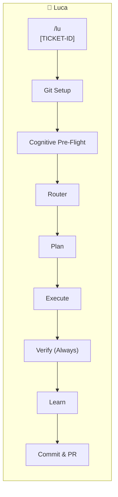

# Agent Framework Documentation

This directory contains documentation for the AI agent framework.

## Luca (lu)

**The active framework** for spec-driven development with cognitive memory and integrated git workflow:

- **Ticket-to-PR workflow**: Single command handles ticket → GitHub issue → branch → execute → PR
- Spec-driven architecture and verification
- Cognitive analysis and learning
- **Two-tier memory**: WORKING.md (session) + MEMORY.md (long-term)
- **Always verify**: Verification runs at all complexity levels
- **Unified entry point**: `/lu`

📁 [View Documentation](./luca/) | 📋 [Workflow Reference](../../.cursor/rules/lu-workflow.mdc)

## Quick Start

```bash
# Ticket-driven work (most common)
/lu [TICKET-ID]                                    # Pass ticket ID
/lu $JIRA_BASE_URL/browse/[TICKET-ID]              # Or full URL

# Ad-hoc work (no ticket)
/lu "fix the typo in readme"                       # Prompted for placeholder

# For new projects
/lu-new-project

# Check progress
/lu-progress
```

## Architecture



## Documentation

- [Overview & Quick Start](./luca/README.md)
- [End-to-End Workflow](./luca/end-to-end-workflow.md)
- [Visual Diagrams](./luca/diagrams.md)
- [Architecture](./luca/architecture-plan.md)

## State Management

Luca uses `.planning/` for state:

```
.planning/
├── BRAIN.md      # Project identity (persistent)
├── STATE.md      # Session state + git context (ticket, issue, branch)
├── MEMORY.md     # Long-term learnings (persistent)
├── WORKING.md    # Session memory (cleared after learning capture)
├── PROJECT.md    # Vision & scope
├── ROADMAP.md    # Phase structure
├── config.json   # Workflow preferences
├── todos/        # Captured ideas and tasks
├── debug/        # Active debug sessions
├── codebase/     # Codebase analysis (from /lu-map-codebase)
└── phases/       # Execution plans
```

**STATE.md Git Context** (tracked throughout workflow):

```markdown
## Git Context

- Ticket: [TICKET-ID]
- GitHub Issue: #456
- Branch: [TICKET-ID]--fix-description
- Base Branch: [RELEASE-ID]--release
```

## Key Commands

| Command                                | Purpose                                             |
| -------------------------------------- | --------------------------------------------------- |
| `/lu <task \| [TICKET-ID] \| Jira-URL>` | Unified entry: git setup → routing → execution → PR |
| `/lu-new-project`                   | Initialize project                                  |
| `/lu-map-codebase`                  | Analyze existing code                               |
| `/lu-new-milestone`                 | Start new milestone cycle                           |
| `/lu-complete-milestone`            | Archive milestone, consolidate learnings            |
| `/lu-audit-milestone`               | Audit milestone against original intent             |
| `/lu-research-phase [N]`            | Deep ecosystem research for phases                  |
| `/lu-plan-phase [N]`                | Create phase plans                                  |
| `/lu-execute-phase [N]`             | Execute + verify + learn                            |
| `/lu-progress`                      | Check current state                                 |
| `/lu-debug`                         | Memory-aided debugging                              |
| `/lu-resume-work`                   | Resume from previous session                        |
| `/lu-address-pr`                    | Address PR comments with agent swarm                |
| `/lu-settings`                      | Configure workflow toggles                          |
| `/lu-help`                          | Full command reference                              |

### Unified Entry Flags

| Flag              | Purpose                            |
| ----------------- | ---------------------------------- |
| `--force-complex` | Force full planning pipeline       |
| `--skip-memory`   | Skip memory recall (fresh start)   |
| `--skip-branch`   | Skip branch creation (use current) |
