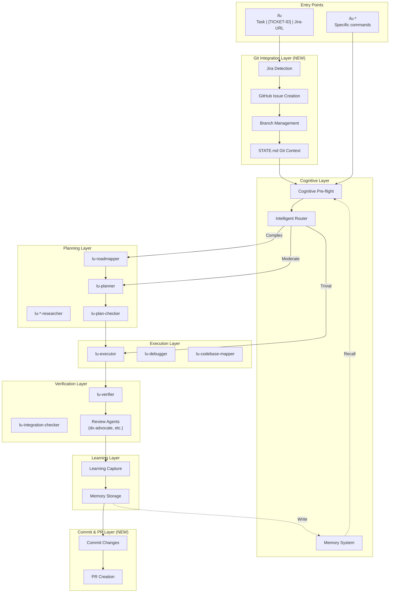
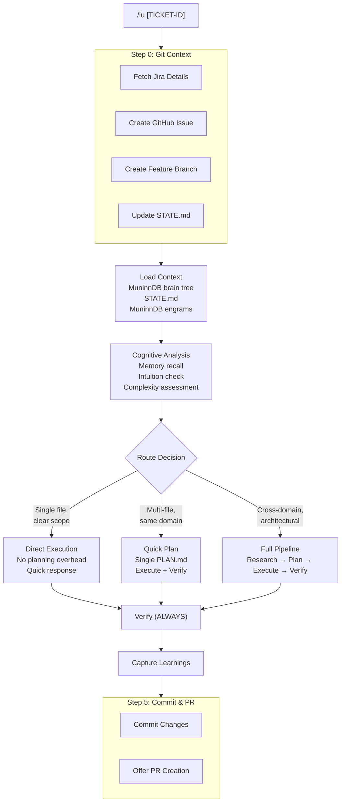
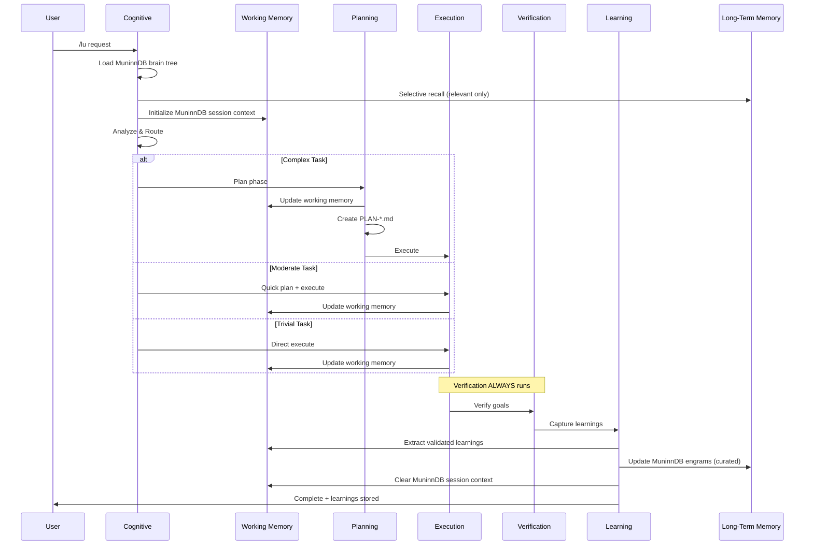

# Luca - Architecture Plan

## System Overview



## Agent Hierarchy

### Tier 0: Git Integration (Step 0)

Not a separate agent - handled by the `/lu` unified entry skill:

| Step            | Purpose                | Inputs                      | Outputs                         |
| --------------- | ---------------------- | --------------------------- | ------------------------------- |
| Jira Detection  | Parse input for ticket | Task, [TICKET-ID], Jira URL | Jira ticket ID                  |
| Issue Creation  | Create GitHub issue    | Jira details, MCP tools     | GitHub issue #number            |
| Branch Creation | Create feature branch  | Ticket, ENG base branch     | [TICKET-ID]--description branch |
| State Update    | Track git context      | All above                   | Updated STATE.md                |

### Tier 1: Cognitive Agents

| Agent          | Purpose                       | Inputs                                         | Outputs                                  |
| -------------- | ----------------------------- | ---------------------------------------------- | ---------------------------------------- |
| `lu-cognition` | Pre-flight analysis           | Request, MuninnDB brain tree, MuninnDB engrams | Cognitive report, routing recommendation |
| `lu-router`    | Route to appropriate workflow | Cognitive report                               | Command to execute                       |

### Tier 2: Planning Agents (From legacy framework)

| Agent                     | Purpose                 | Inputs                         | Outputs           |
| ------------------------- | ----------------------- | ------------------------------ | ----------------- |
| `lu-roadmapper`           | Create phase structure  | PROJECT.md, REQUIREMENTS.md    | ROADMAP.md        |
| `lu-planner`              | Create execution plans  | Phase goals, cognitive context | PLAN-\*.md        |
| `lu-project-researcher`   | Research ecosystem      | Project domain                 | Research findings |
| `lu-phase-researcher`     | Research phase approach | Phase goals                    | RESEARCH.md       |
| `lu-research-synthesizer` | Combine research        | Multiple research outputs      | SUMMARY.md        |
| `lu-plan-checker`         | Validate plans          | PLAN-\*.md                     | Validation report |

### Tier 3: Execution Agents (From legacy framework)

| Agent                | Purpose          | Inputs                             | Outputs               |
| -------------------- | ---------------- | ---------------------------------- | --------------------- |
| `lu-executor`        | Execute tasks    | PLAN-\*.md, cognitive context      | Code changes, commits |
| `lu-debugger`        | Investigate bugs | Bug description, cognitive context | Fix or diagnosis      |
| `lu-codebase-mapper` | Analyze code     | Codebase                           | Analysis documents    |

### Tier 4: Verification Agents (From legacy framework)

| Agent                    | Purpose               | Inputs                   | Outputs            |
| ------------------------ | --------------------- | ------------------------ | ------------------ |
| `lu-verifier`            | Verify goals achieved | Success criteria         | VERIFICATION.md    |
| `lu-integration-checker` | Check E2E flows       | Phase integration points | Integration report |

### Tier 5: Review Agents (External)

| Agent              | Purpose              | Notes          |
| ------------------ | -------------------- | -------------- |
| `dx-advocate`      | Developer experience | Already exists |
| `code-simplifier`  | Reduce complexity    | Already exists |
| `security-auditor` | Security review      | Already exists |

### Tier 6: Learning Agents

| Agent        | Purpose           | Inputs                             | Outputs                  |
| ------------ | ----------------- | ---------------------------------- | ------------------------ |
| `lu-learner` | Extract learnings | VERIFICATION.md, execution history | MuninnDB engrams updates |

### Tier 7: Commit & PR (Step 5)

Not a separate agent - handled by the `/lu` unified entry skill:

| Step     | Purpose             | Inputs                    | Outputs    |
| -------- | ------------------- | ------------------------- | ---------- |
| Commit   | Stage and commit    | Changes, STATE.md context | Git commit |
| PR Offer | Create pull request | Branch, base, Jira ticket | GitHub PR  |

## Skill Commands

### Primary Entry Point

```
/lu <task | [TICKET-ID] | Jira-URL> [--force-complex] [--skip-memory] [--skip-branch]
```

Full workflow with git integration:



### Git Context Input Types

| Input      | Example                                              | Behavior                                 |
| ---------- | ---------------------------------------------------- | ---------------------------------------- |
| Jira URL   | `https://mypercent.atlassian.net/browse/[TICKET-ID]` | Extracts [TICKET-ID], fetches details    |
| Ticket ID  | `[TICKET-ID]`                                        | Fetches details from Jira                |
| Plain task | `"fix the button"`                                   | Prompts for Jira ticket or [PLACEHOLDER] |

### [PLACEHOLDER] Placeholder

For work without a Jira ticket:

- Quick fixes, typos, minor improvements
- Tech debt identified during development
- GitHub Issues not from Jira
- Documentation updates

**Key principle:** If no Jira ticket, use [PLACEHOLDER]. Don't create Jira tickets just to have a number.

### Specific Commands

| Command                  | Purpose                   | When to Use        |
| ------------------------ | ------------------------- | ------------------ |
| `/lu-new-project`        | Initialize new project    | Starting fresh     |
| `/lu-new-milestone`      | Add milestone to existing | New major feature  |
| `/lu-plan-phase`         | Create phase plans        | Ready to plan      |
| `/lu-execute-phase`      | Execute current phase     | Plans ready        |
| `/lu-discuss-phase`      | Discuss before planning   | Need clarification |
| `/lu-complete-milestone` | Archive and move on       | Phase verified     |
| `/lu-debug`              | Investigate issues        | Bugs or failures   |
| `/lu-verify`             | Run verification          | Check progress     |
| `/lu-learn`              | Capture learnings         | After completion   |

## State Management

### File Structure

```
.planning/
├── MuninnDB brain tree              # Project identity (persistent)
│   ├── Identity
│   ├── Stack
│   ├── Conventions
│   └── Personality
│
├── MuninnDB engrams             # Long-term memory (persistent, curated)
│   ├── Patterns (validated)
│   ├── Decisions (confirmed)
│   ├── Pitfalls (proven)
│   └── Preferences (established)
│
├── MuninnDB session context            # Working memory (session-only)
│   ├── Current context
│   ├── Immediate findings
│   ├── Hypotheses
│   └── In-progress notes
│   └── [Cleared on workflow completion]
│
├── PROJECT.md            # Vision & scope
│   ├── Vision
│   ├── Scope
│   └── Constraints
│
├── REQUIREMENTS.md       # Detailed requirements
│   └── Per milestone
│
├── ROADMAP.md            # Phase structure
│   ├── Phases
│   ├── Dependencies
│   └── Success criteria
│
├── STATE.md              # Session state (Enhanced)
│   ├── Current focus
│   ├── Recent activity
│   ├── Next steps
│   ├── Git context           # NEW - Jira/GitHub integration
│   │   ├── Ticket
│   │   ├── GitHub Issue
│   │   ├── Branch
│   │   ├── Base Branch
│   │   └── Task Complexity
│   ├── Cognitive state
│   │   ├── Memory recall
│   │   ├── Intuition flags
│   │   └── Feel context
│   └── Blockers
│
├── config.json           # Workflow preferences (Enhanced)
│   ├── mode
│   ├── depth
│   ├── model_profile
│   ├── workflow
│   ├── gates
│   ├── cognitive
│   │   ├── enabled
│   │   ├── memory_recall
│   │   └── routing
│   └── safety
│
├── todos/                # Captured ideas and tasks
├── debug/                # Active debug sessions
├── codebase/             # Codebase map (brownfield)
├── quick/                # Quick task artifacts
│
└── phases/
    └── phase-X/
        ├── PLAN-01.md
        ├── PLAN-02.md
        ├── SUMMARY-01.md
        ├── VERIFICATION.md
        ├── LEARNINGS.md
        └── UAT.md
```

### State Flow



**Key Principle**: Verification happens at ALL complexity levels. Quality is never skipped.

## Cognitive Pre-Flight Protocol

### When It Runs

- Before `/lu` routing decision
- Before `/lu-plan-phase` planning
- Before `/lu-execute-phase` execution
- Before `/lu-debug` investigation

### What It Does

```
┌─────────────────────────────────────────────────────────────┐
│                    COGNITIVE PRE-FLIGHT                     │
├─────────────────────────────────────────────────────────────┤
│                                                             │
│  1. MEMORY RECALL                                           │
│     ├─ Query MuninnDB engrams for similar tasks                    │
│     ├─ Find relevant patterns                               │
│     ├─ Recall previous decisions                            │
│     └─ Note known pitfalls                                  │
│                                                             │
│  2. INTUITION CHECK                                         │
│     ├─ Flag potential risks                                 │
│     ├─ Identify uncertainty areas                           │
│     ├─ Note scope concerns                                  │
│     └─ Highlight dependencies                               │
│                                                             │
│  3. FEEL AWARENESS                                          │
│     ├─ Load user preferences                                │
│     ├─ Check project conventions (MuninnDB brain tree)                 │
│     ├─ Consider team patterns                               │
│     └─ Note communication style                             │
│                                                             │
│  4. REASON ANALYSIS                                         │
│     ├─ Evaluate logical approach                            │
│     ├─ Check dependency order                               │
│     ├─ Assess scope appropriateness                         │
│     └─ Recommend complexity level                           │
│                                                             │
├─────────────────────────────────────────────────────────────┤
│  OUTPUT: Cognitive Report                                   │
│  ├─ Routing recommendation (trivial/moderate/complex)       │
│  ├─ Memory context to carry forward                         │
│  ├─ Intuition flags to address                              │
│  └─ Conventions to follow                                   │
└─────────────────────────────────────────────────────────────┘
```

## Learning Capture Protocol

### When It Runs

- After successful verification
- After milestone completion
- After significant debugging sessions

### What It Captures

```
┌─────────────────────────────────────────────────────────────┐
│                    LEARNING CAPTURE                         │
├─────────────────────────────────────────────────────────────┤
│                                                             │
│  1. PATTERNS                                                │
│     ├─ What approaches worked well?                         │
│     ├─ What code patterns were effective?                   │
│     └─ What testing strategies succeeded?                   │
│                                                             │
│  2. DECISIONS                                               │
│     ├─ What architectural choices were made?                │
│     ├─ What trade-offs were accepted?                       │
│     └─ What alternatives were rejected (and why)?           │
│                                                             │
│  3. PITFALLS                                                │
│     ├─ What issues were encountered?                        │
│     ├─ What approaches didn't work?                         │
│     └─ What should be avoided in future?                    │
│                                                             │
│  4. PREFERENCES                                             │
│     ├─ What did the user prefer?                            │
│     ├─ What conventions emerged?                            │
│     └─ What feedback was given?                             │
│                                                             │
├─────────────────────────────────────────────────────────────┤
│  OUTPUT: MuninnDB engrams Update                                   │
│  ├─ New patterns section                                    │
│  ├─ Decision log entry                                      │
│  ├─ Pitfall warning                                         │
│  └─ Updated preferences                                     │
└─────────────────────────────────────────────────────────────┘
```

## Model Profile Integration

### Base Profiles

| Agent         | quality | balanced | budget |
| ------------- | ------- | -------- | ------ |
| lu-cognition  | opus    | sonnet   | haiku  |
| lu-planner    | opus    | opus     | sonnet |
| lu-roadmapper | opus    | sonnet   | sonnet |
| lu-executor   | opus    | sonnet   | sonnet |
| lu-verifier   | sonnet  | sonnet   | haiku  |
| lu-debugger   | opus    | sonnet   | sonnet |
| lu-learner    | sonnet  | haiku    | haiku  |

### Cognitive-Adjusted Profiles

When cognitive pre-flight detects high complexity or risk:

```
IF intuition_flags.high_risk OR complexity == "complex":
    UPGRADE model_profile by one tier
IF memory_recall.similar_success:
    MAY DOWNGRADE model_profile (confidence boost)
```

## Integration Points

### With Existing Tools

| Tool       | Integration                        |
| ---------- | ---------------------------------- |
| Taskmaster | Use for task tracking within plans |
| GitHub     | PR creation, issue linking         |
| MCP Tools  | Code analysis, search              |

### With Existing Agents

| Agent            | Usage                                 |
| ---------------- | ------------------------------------- |
| dx-advocate      | Code review after execution           |
| code-simplifier  | Cleanup after verification            |
| security-auditor | Security review for sensitive changes |

### Hooks

| Hook                     | Trigger               | Action                    |
| ------------------------ | --------------------- | ------------------------- |
| `lu-planning-commit.sh`  | After plan creation   | Commit planning artifacts |
| `lu-execution-commit.sh` | After task completion | Atomic task commit        |
| `lu-learning-update.sh`  | After verification    | Update MuninnDB engrams   |
