# Luca - Architecture Diagrams

## High-Level Overview

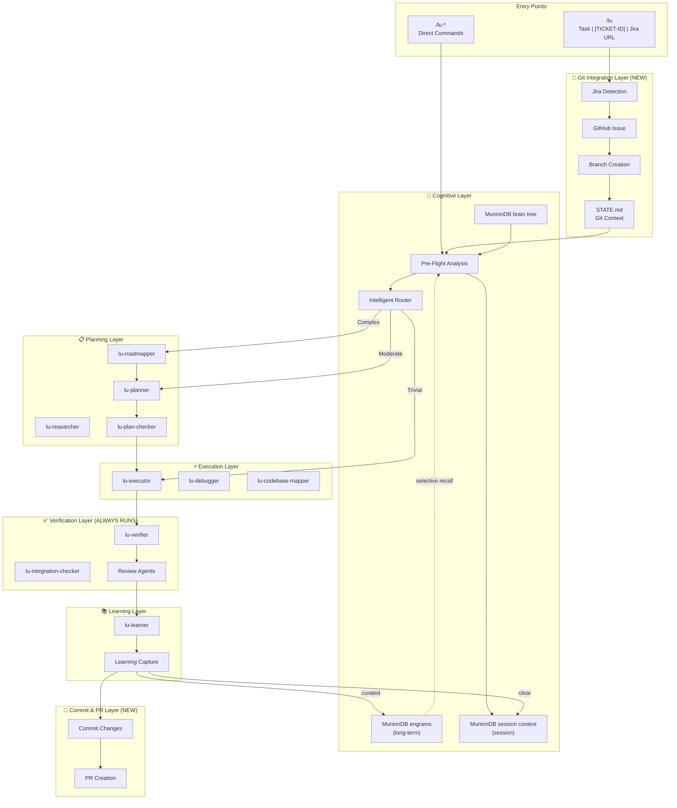

## The Complete Picture

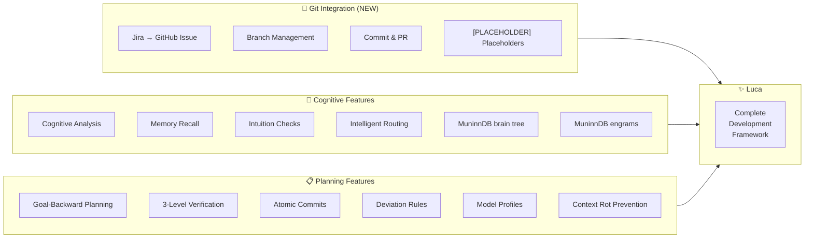

## Git Context Setup Flow (Step 0)

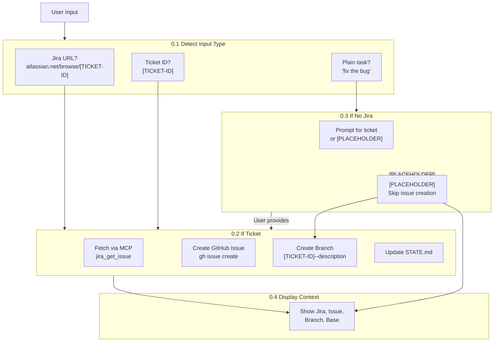

## Cognitive Pre-Flight Flow (Step 1)

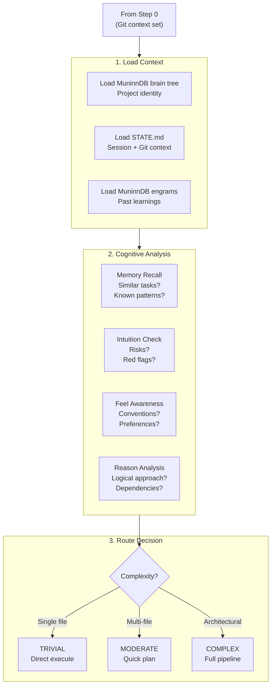

## Learning Capture Flow (Step 4)

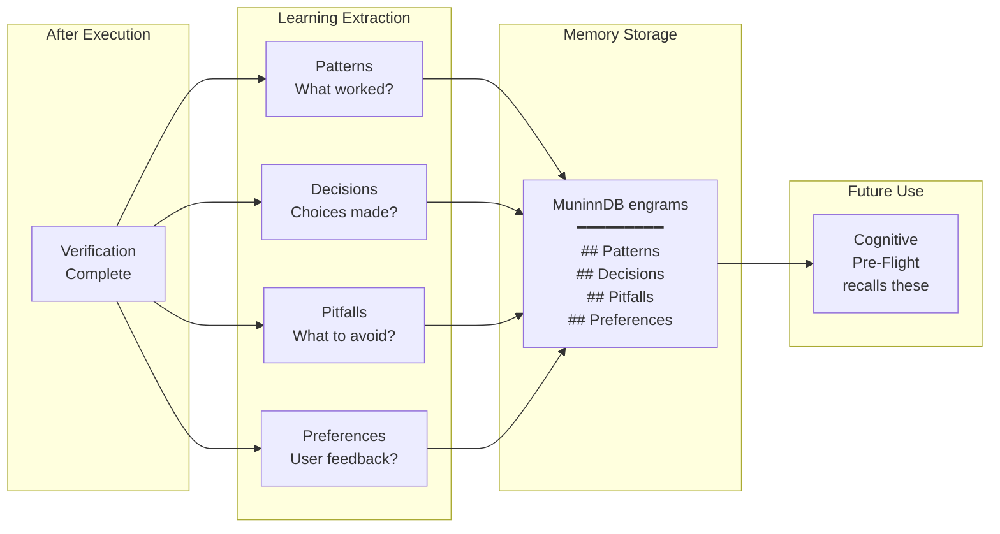

## Commit & PR Flow (Step 5)

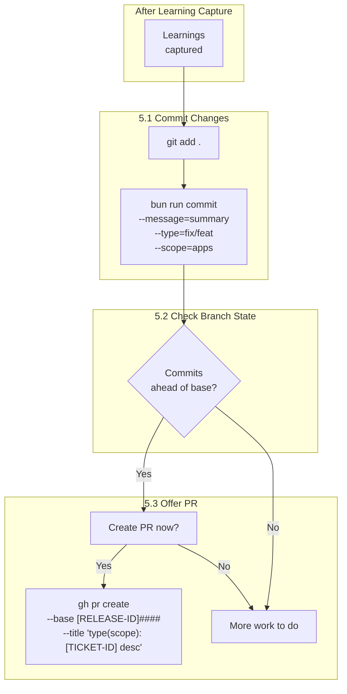

## Agent Hierarchy

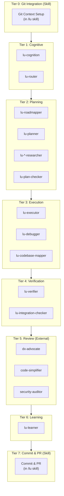

## Command Structure

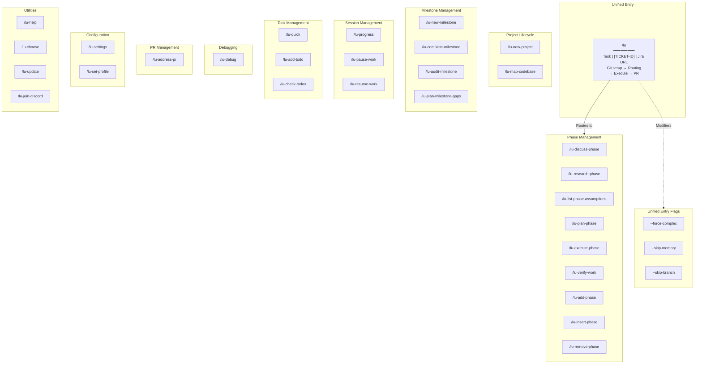

## Two-Tier Memory System

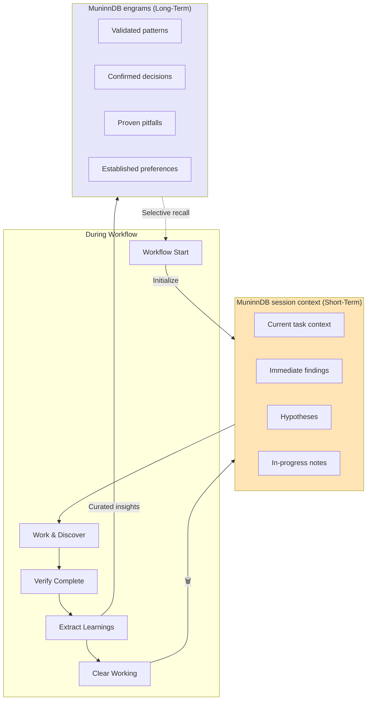

### Memory Flow Timeline

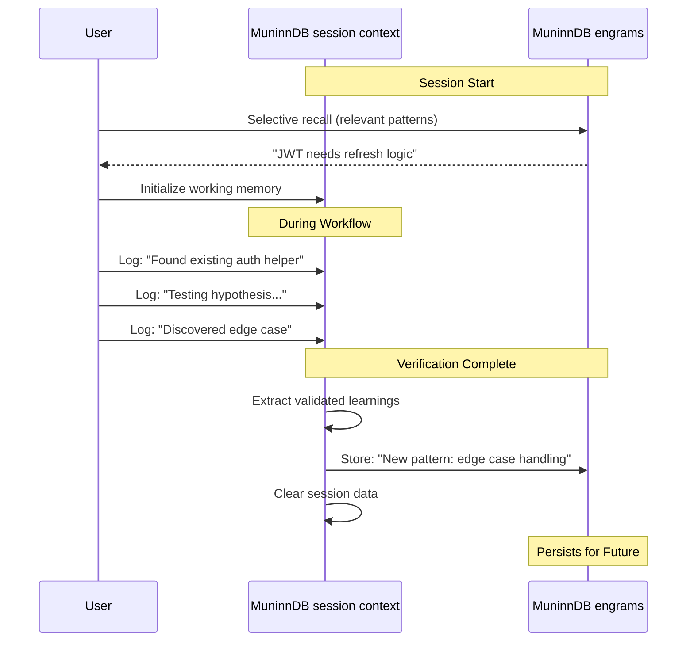

## State File Organization

```mermaid
flowchart TB
    subgraph Planning[".planning/ Directory"]
        subgraph Identity["Project Identity"]
            BRAIN["MuninnDB brain tree<br/>━━━━━━━━━<br/>Identity<br/>Stack<br/>Conventions"]
            PROJECT["PROJECT.md<br/>━━━━━━━━━<br/>Vision<br/>Scope<br/>Constraints"]
        end

        subgraph Learning["Learning Storage"]
            MEMORY["MuninnDB engrams<br/>━━━━━━━━━<br/>Patterns<br/>Decisions<br/>Pitfalls"]
        end

        subgraph Session["Session State"]
            STATE["STATE.md<br/>━━━━━━━━━<br/>Focus<br/>Git Context (NEW)<br/>• Ticket<br/>• GitHub Issue<br/>• Branch<br/>• Base Branch<br/>Cognitive state"]
            CONFIG["config.json<br/>━━━━━━━━━<br/>Workflow<br/>Cognitive<br/>Gates"]
        end

        subgraph Utils["Utilities"]
            TODOS["todos/<br/>Captured ideas"]
            DEBUG["debug/<br/>Debug sessions"]
            QUICK["quick/<br/>Quick tasks"]
        end

        subgraph Structure["Project Structure"]
            REQS["REQUIREMENTS.md"]
            ROADMAP["ROADMAP.md"]
        end

        subgraph Phases["phases/phase-X/"]
            PLANS["PLAN-*.md"]
            SUMMARIES["SUMMARY-*.md"]
            VERIFY["VERIFICATION.md"]
            LEARNINGS["LEARNINGS.md"]
        end
    end

    Identity --> Session
    Session --> Utils
    Utils --> Structure
    Structure --> Phases
    Phases --> Learning
```

## Complexity Routing

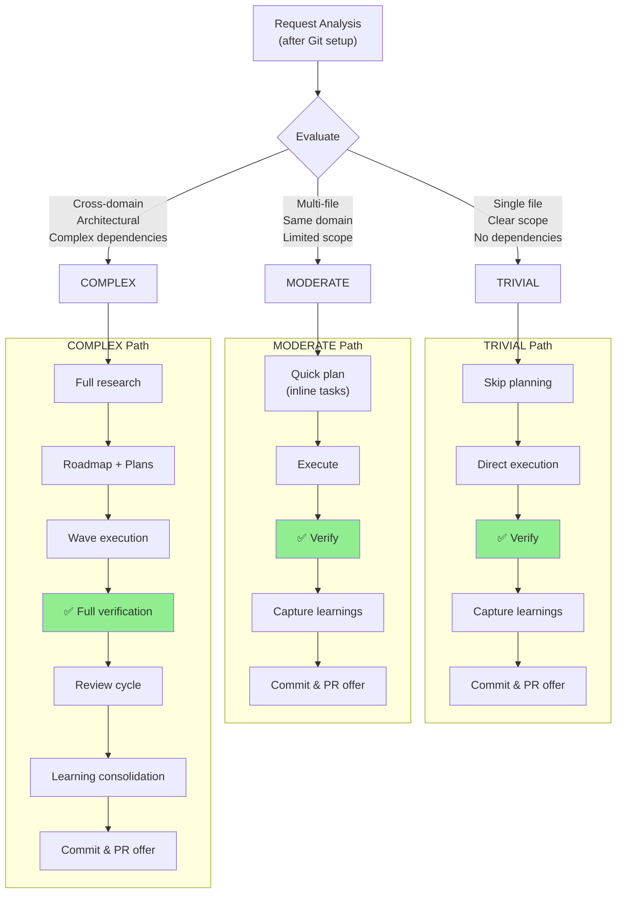

**Key Principles**:

- Verification ALWAYS runs regardless of complexity level
- Commit & PR offer comes at the end of ALL paths

## Complete Workflow Overview

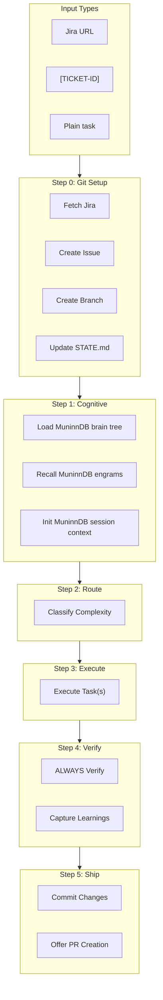

## Implementation Phases

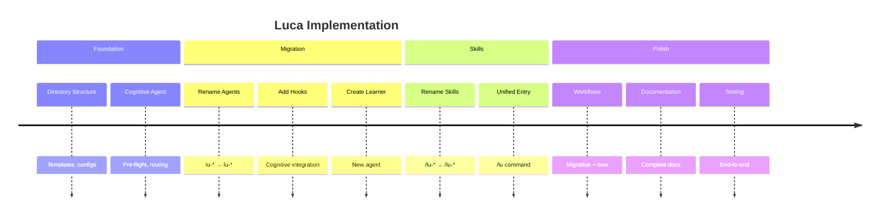
