# Luca - End-to-End Workflow

This document walks through how Luca works from start to finish.

## The Big Picture

```mermaid
flowchart LR
    subgraph Start["🚀 Start"]
        USER["User Request<br/>PT-1234 | Jira URL | Task"]
    end

    subgraph Git["🔗 Git Setup"]
        JIRA["Jira Fetch"]
        ISSUE["GitHub Issue"]
        BRANCH["Branch"]
    end

    subgraph Cognitive["🧠 Think"]
        LOAD["Load Context"]
        ANALYZE["Analyze"]
        ROUTE["Route"]
    end

    subgraph Plan["📋 Plan"]
        RESEARCH["Research"]
        ROADMAP["Structure"]
        TASKS["Tasks"]
    end

    subgraph Execute["⚡ Do"]
        CODE["Code"]
        COMMIT["Commit"]
    end

    subgraph Verify["✅ Check"]
        GOALS["Goals Met?"]
        REVIEW["Review"]
    end

    subgraph Learn["📚 Remember"]
        CAPTURE["Extract"]
        STORE["Store"]
    end

    subgraph PR["🚢 Ship"]
        PROPT["PR Offer"]
    end

    USER --> Git
    Git --> LOAD --> ANALYZE --> ROUTE
    ROUTE --> RESEARCH --> ROADMAP --> TASKS
    TASKS --> CODE --> COMMIT
    COMMIT --> GOALS --> REVIEW
    REVIEW --> CAPTURE --> STORE --> PR
```

---

## Scenario 0: Jira-Driven Task (Most Common)

**User has a Jira ticket and wants to implement it.**

```
User: /lu PT-1234
```

**What happens:**

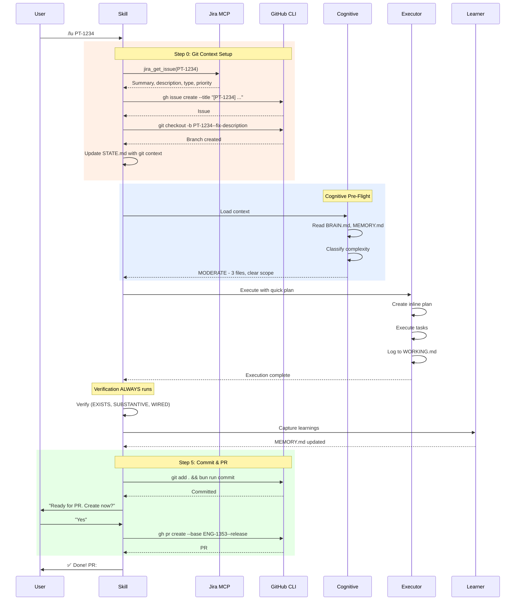

**Git context tracked in STATE.md:**

```markdown
## Git Context

- Jira Ticket: PT-1234
- GitHub Issue: #456
- Branch: PT-1234--fix-performance-issue
- Base Branch: ENG-1353--release
- Task Complexity: MODERATE (classified 2026-02-03 10:45)
```

---

## Scenario 0.1: Ad-Hoc Task (No Jira)

**User has a quick fix without a Jira ticket.**

```
User: /lu fix the typo in the readme
```

**What happens:**

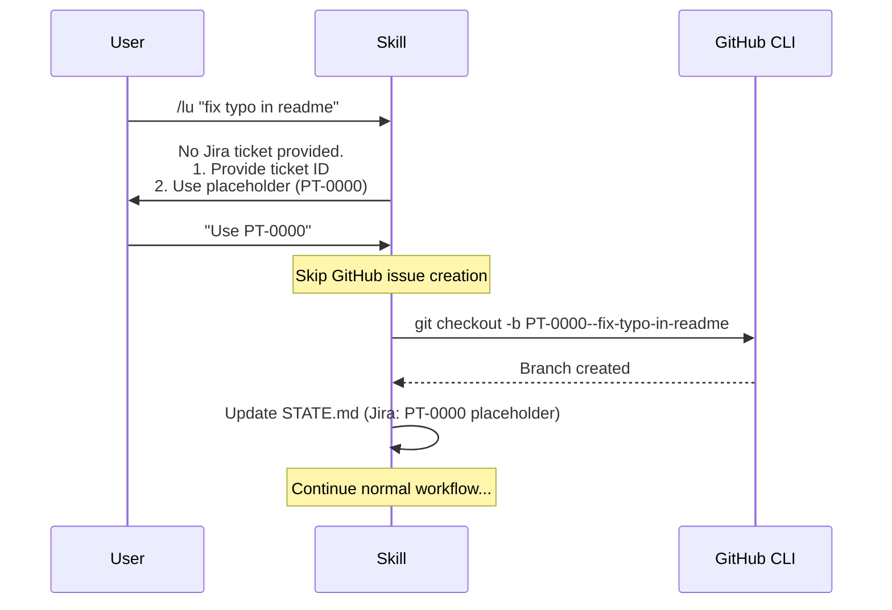

**When to use PT-0000:**

- Quick fixes, typos, minor improvements
- Tech debt identified during development
- GitHub Issues not from Jira
- Documentation updates
- Dependency updates

---

## Scenario 1: New Project

**User wants to build a new feature from scratch.**

### Step 1: Initialize Project

```
User: /lu-new-project
```

**What happens:**

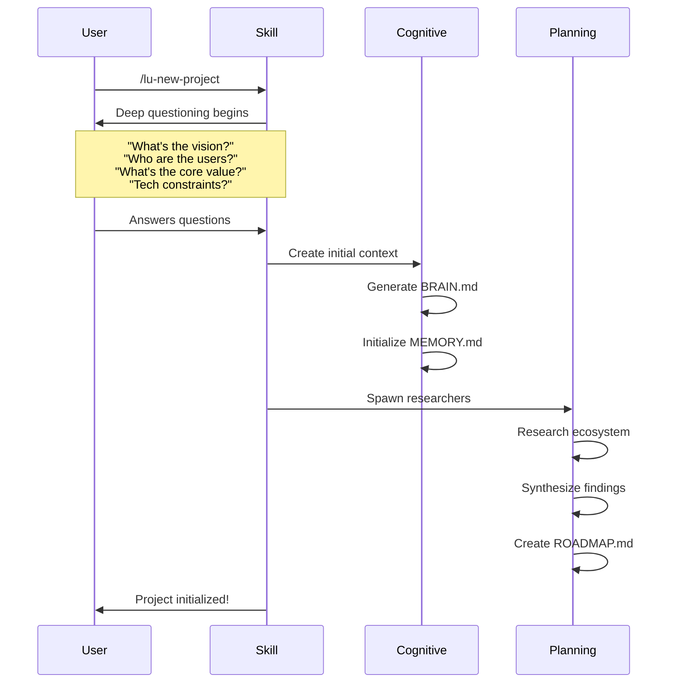

**Files created:**

```
.planning/
├── BRAIN.md          # Project identity, stack, conventions
├── MEMORY.md         # Empty, ready for learnings
├── STATE.md          # Initial session state
├── config.json       # Default workflow preferences
├── PROJECT.md        # Vision & scope
├── REQUIREMENTS.md   # Detailed requirements
└── ROADMAP.md        # Phase structure with success criteria
```

### Step 2: Plan First Phase

```
User: /lu-plan-phase
```

**What happens:**

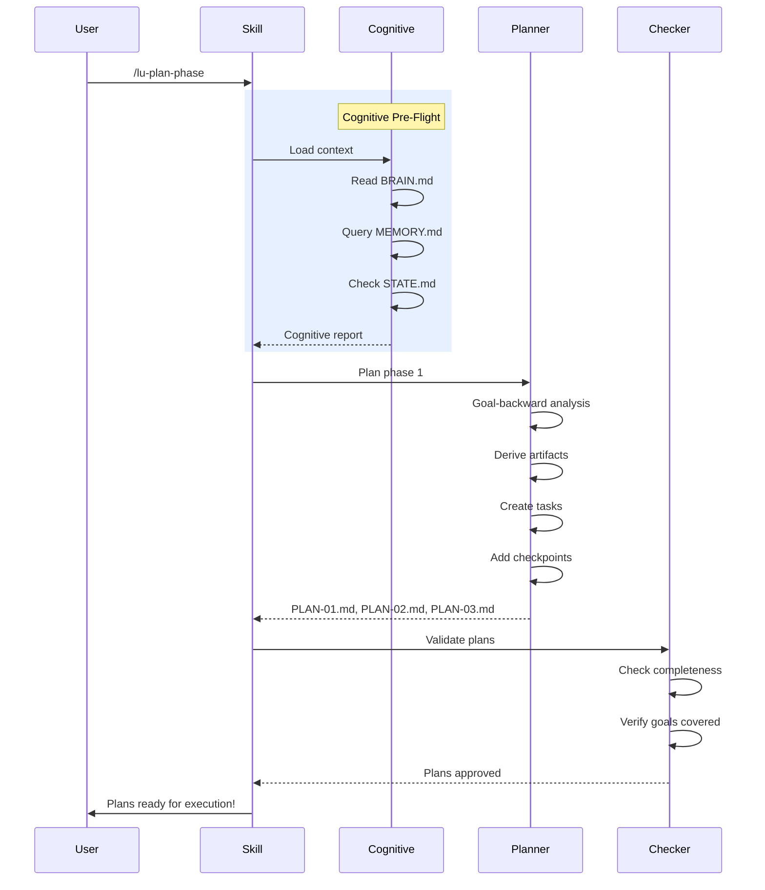

**Plans created:**

```
.planning/phases/phase-1/
├── PLAN-01.md    # First batch of tasks
├── PLAN-02.md    # Second batch (depends on 01)
└── PLAN-03.md    # Third batch (depends on 02)
```

### Step 3: Execute Phase

```
User: /lu-execute-phase
```

**What happens:**

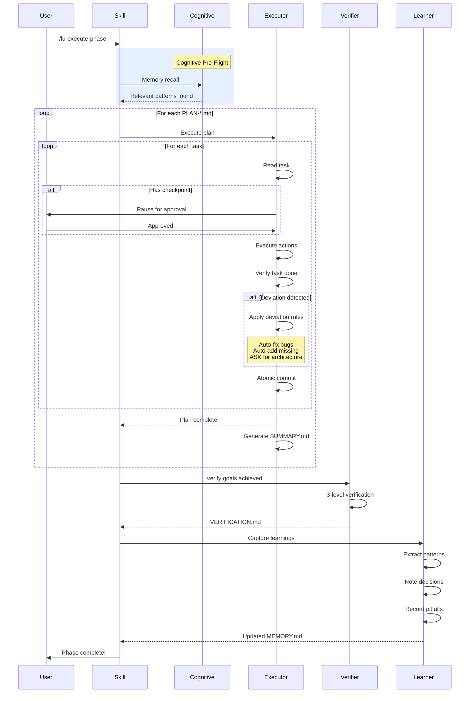

**What the executor does for each task:**

```
┌─────────────────────────────────────────────────────────────┐
│                    TASK EXECUTION                           │
├─────────────────────────────────────────────────────────────┤
│                                                             │
│  1. READ TASK                                               │
│     ├─ Goal: What observable truth are we achieving?        │
│     ├─ Artifacts: What files/code should exist?             │
│     └─ Actions: What steps to take?                         │
│                                                             │
│  2. CHECK FOR CHECKPOINT                                    │
│     ├─ human-verify: "Does this look right?"                │
│     ├─ decision: "Option A or B?"                           │
│     └─ human-action: "Please do X manually"                 │
│                                                             │
│  3. EXECUTE ACTIONS                                         │
│     ├─ Create/modify files                                  │
│     ├─ Run commands                                         │
│     └─ Wire integrations                                    │
│                                                             │
│  4. VERIFY TASK                                             │
│     ├─ EXISTS: Do the files exist?                          │
│     ├─ SUBSTANTIVE: Is the code correct?                    │
│     └─ WIRED: Is it connected to the system?                │
│                                                             │
│  5. HANDLE DEVIATIONS                                       │
│     ├─ Bug blocking progress → AUTO-FIX                     │
│     ├─ Missing critical → AUTO-ADD                          │
│     ├─ Architecture change → ASK USER                       │
│     └─ Performance concern → LOG                            │
│                                                             │
│  6. COMMIT                                                  │
│     └─ feat(1.0-01): #task-id description                   │
│                                                             │
└─────────────────────────────────────────────────────────────┘
```

---

## Scenario 2: Quick Task (Unified Entry)

**User has a simple request that doesn't need full planning.**

```
User: /lu "Add a loading spinner to the login button"
```

**What happens:**

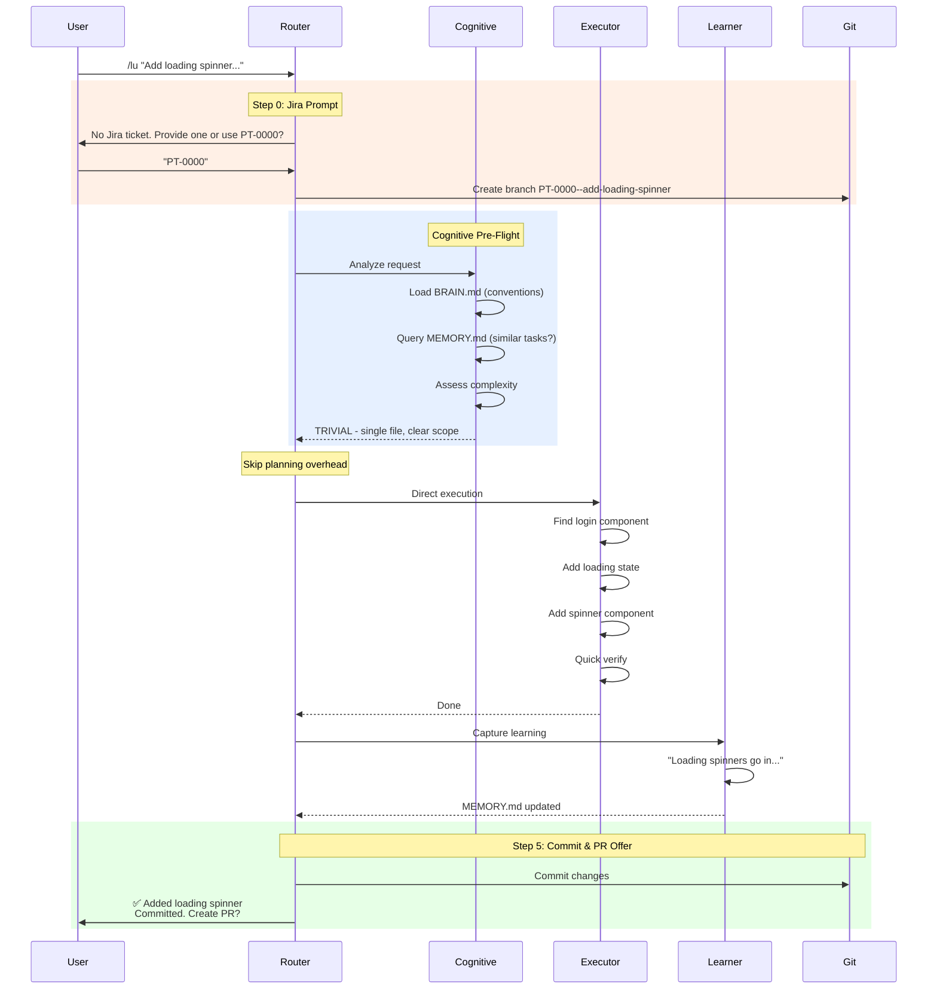

**Routing decision tree:**

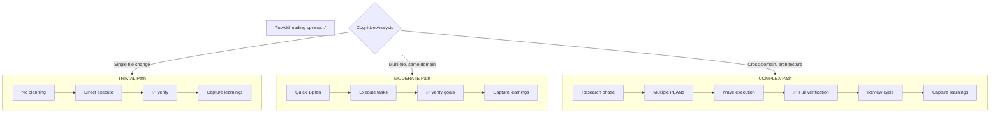

**Key principle: Verification ALWAYS happens, regardless of complexity.**

---

## Scenario 3: Debugging

**Something broke and user needs help fixing it.**

```
User: /lu-debug "Login fails with 401 after token refresh"
```

**What happens:**

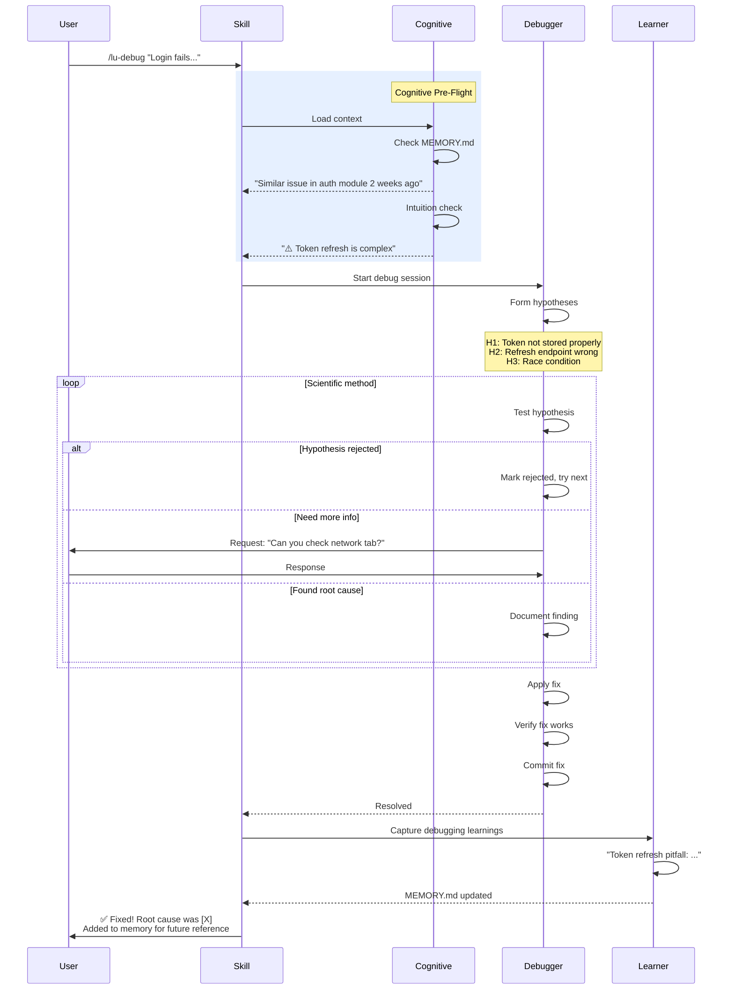

---

## Scenario 4: Continuing Work

**User starts a new session and wants to continue where they left off.**

```
User: /lu "Continue from yesterday"
```

**What happens:**

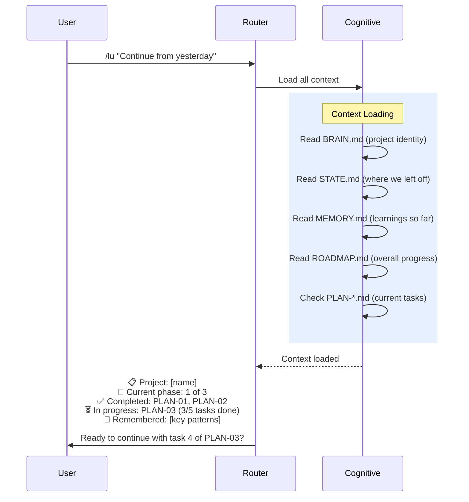

---

## The Two-Tier Memory System

**Working Memory vs Long-Term Memory:**

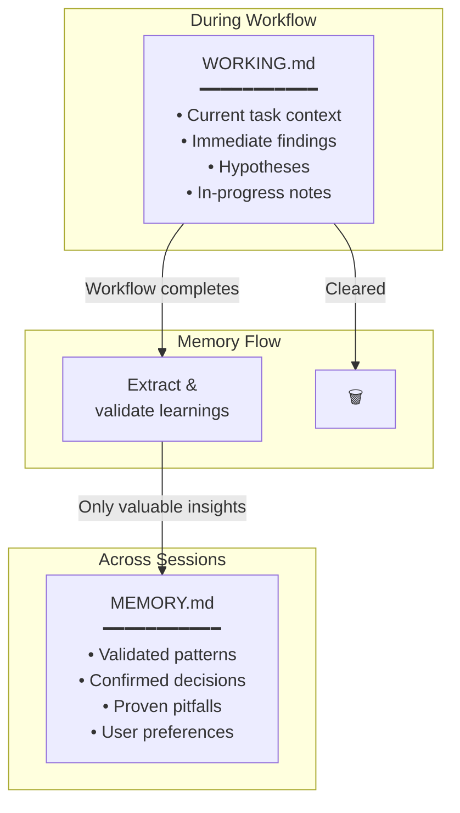

### Working Memory (`WORKING.md`)

**Purpose**: Active context during a workflow run. Always loaded, never pollutes long-term memory.

```markdown
# Working Memory - Session 2024-01-20T14:30

## Current Context

- Task: Add authentication to investor portal
- Phase: 1 of 3
- Plan: PLAN-02, task 3 of 5

## Immediate Findings

- Found existing auth helper in packages-ui/hooks/use-auth
- Manager portal uses different token format (legacy)
- Need to handle both formats during migration

## Hypotheses

- [ ] Can reuse investor-ui auth flow? → Testing...
- [x] Need new refresh endpoint? → No, existing works

## In-Progress Notes

- Started with LoginForm component
- Discovered token storage uses localStorage (security concern?)
- TODO: Ask about httpOnly cookie migration
```

**Lifecycle**: Created at workflow start → Used throughout → Cleared on completion

### Long-Term Memory (`MEMORY.md`)

**Purpose**: Persistent learnings that compound over time. Selectively recalled when relevant.

```markdown
# Project Memory

## Patterns

### Authentication

- Pattern: JWT tokens with refresh logic
- When: Any API authentication
- Example: See auth/token-service.ts
- Confidence: High (used 5+ times)

### API Design

- Pattern: Rate limiting on all endpoints
- When: Any new API route
- Example: See middleware/rate-limit.ts
- Confidence: High (prevented 2 incidents)

## Decisions

### 2024-01-15 - Chose JWT over sessions

- Context: Needed stateless auth for microservices
- Choice: JWT with 15min access, 7d refresh
- Rationale: Better for horizontal scaling
- Status: Validated in production

### 2024-01-20 - Added rate limiting

- Context: Abuse prevention needed
- Choice: Token bucket, 100/min per user
- Rationale: Balances UX with protection
- Status: Validated in production

## Pitfalls

### Token Refresh Race Condition

- What happened: Multiple tabs refreshed simultaneously
- How to avoid: Add mutex/lock on refresh
- Reference: PR #123
- Severity: High (caused production incident)

## Preferences

### Code Style

- Prefer: Early returns over nested ifs
- Prefer: Explicit types over inference for APIs
- Source: User feedback on PR #145
```

**Selective Recall**: Not everything is loaded into context. Only relevant sections based on current task.

### Memory Flow Across Sessions

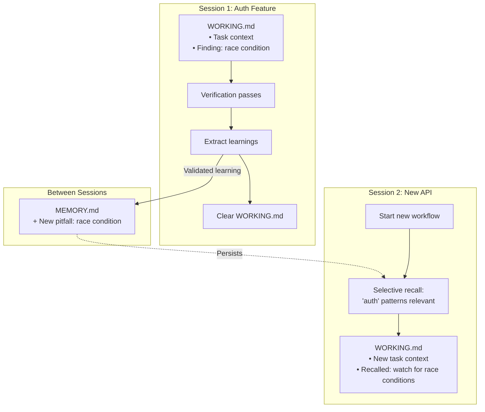

### Why Two-Tier Memory?

| Problem                                          | Solution                                         |
| ------------------------------------------------ | ------------------------------------------------ |
| Context gets polluted with task-specific details | WORKING.md keeps transient info separate         |
| Valuable learnings get lost                      | MEMORY.md persists validated insights            |
| Irrelevant memories loaded unnecessarily         | Selective recall based on current task           |
| Hard to know what's validated vs in-progress     | Clear separation: WORKING = now, MEMORY = proven |

---

## End-to-End Summary

```
┌─────────────────────────────────────────────────────────────┐
│              PERCENT ORIGIN END-TO-END                      │
├─────────────────────────────────────────────────────────────┤
│                                                             │
│  1. USER REQUEST                                            │
│     └─ /lu or /lu-* command                          │
│                                                             │
│  2. COGNITIVE PRE-FLIGHT                                    │
│     ├─ Load BRAIN.md (who are we?)                          │
│     ├─ Selective recall from MEMORY.md (relevant only)      │
│     ├─ Initialize WORKING.md (session context)              │
│     ├─ Check STATE.md (where are we?)                       │
│     ├─ Run intuition checks (any risks?)                    │
│     └─ Classify complexity (trivial/moderate/complex)       │
│                                                             │
│  3. ROUTE TO APPROPRIATE PATH                               │
│     ├─ Trivial → Direct execution → VERIFY                  │
│     ├─ Moderate → Quick plan + execute → VERIFY             │
│     └─ Complex → Full pipeline → VERIFY                     │
│     └─ ✅ VERIFICATION ALWAYS RUNS                          │
│                                                             │
│  4. PLANNING (if needed)                                    │
│     ├─ Research ecosystem                                   │
│     ├─ Goal-backward analysis                               │
│     ├─ Derive artifacts from goals                          │
│     ├─ Create task breakdown                                │
│     ├─ Update WORKING.md with context                       │
│     └─ Validate plans                                       │
│                                                             │
│  5. EXECUTION                                               │
│     ├─ For each task:                                       │
│     │   ├─ Handle checkpoints                               │
│     │   ├─ Execute actions                                  │
│     │   ├─ Log findings to WORKING.md                       │
│     │   ├─ Handle deviations                                │
│     │   └─ Atomic commit                                    │
│     └─ Generate SUMMARY.md                                  │
│                                                             │
│  6. VERIFICATION (ALWAYS)                                   │
│     ├─ 3-level check (EXISTS/SUBSTANTIVE/WIRED)             │
│     ├─ Goal-backward verification                           │
│     ├─ Code review (dx-advocate, security-auditor, etc.)    │
│     └─ Generate VERIFICATION.md                             │
│                                                             │
│  7. LEARNING CAPTURE                                        │
│     ├─ Review WORKING.md for validated insights             │
│     ├─ Extract patterns that worked                         │
│     ├─ Note decisions made                                  │
│     ├─ Record pitfalls to avoid                             │
│     ├─ Write CURATED learnings to MEMORY.md                 │
│     └─ Clear WORKING.md                                     │
│                                                             │
│  8. READY FOR NEXT REQUEST                                  │
│     ├─ Long-term memory preserved                           │
│     └─ Working memory cleared for fresh start               │
│                                                             │
└─────────────────────────────────────────────────────────────┘
```

---

## Key Differentiators

| Aspect               | Without Luca         | With Luca                          |
| -------------------- | ------------------------------ | -------------------------------------------- |
| **Git Workflow**     | Manual branching, commits, PRs | **Automated Jira → Issue → Branch → PR**     |
| **Jira Integration** | Copy-paste ticket details      | **Single command with ticket ID**            |
| **Context**          | Lost between sessions          | BRAIN.md + MEMORY.md persist                 |
| **Working Memory**   | Pollutes everything            | WORKING.md keeps session separate            |
| **Long-Term Memory** | Non-existent                   | MEMORY.md with curated learnings             |
| **Memory Recall**    | All or nothing                 | Selective recall based on relevance          |
| **Routing**          | User picks command             | Auto-routes by complexity                    |
| **Planning**         | Always full overhead           | Trivial tasks skip planning                  |
| **Verification**     | Sometimes skipped              | **ALWAYS runs** at all complexity levels     |
| **Quality**          | Degrades in long sessions      | Context rot prevention                       |
| **PR Creation**      | Manual after coding            | **Offered automatically after verification** |
