# Luca Agent Framework — Mermaid Diagrams

## 1. System Architecture Overview

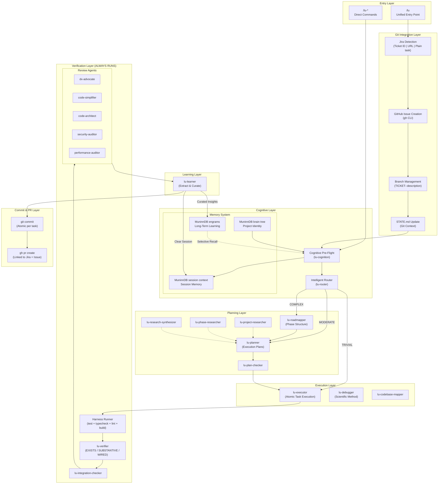

---

## 2. Source Code Module Map

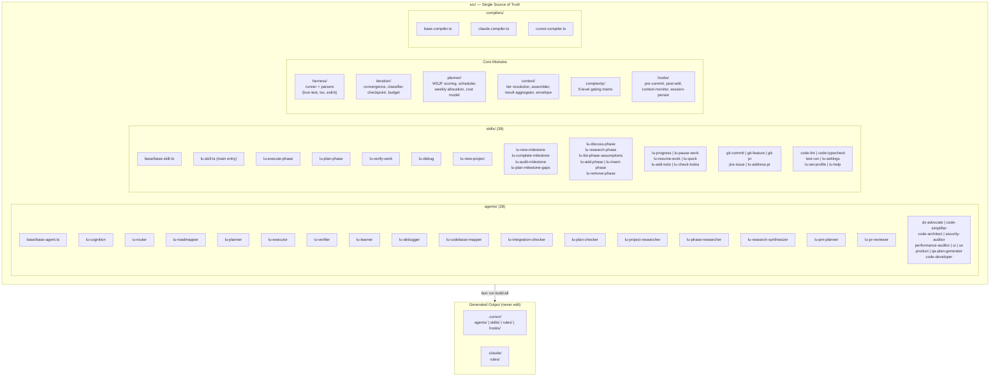

---

## 3. Agent Tier Hierarchy

```mermaid
flowchart LR
    subgraph T0["Tier 0: Git Integration"]
        direction TB
        T0_DESC["Handled by /lu skill<br/>Jira fetch, GitHub issue,<br/>branch creation, STATE.md"]
    end

    subgraph T1["Tier 1: Cognitive"]
        direction TB
        T1_COG["lu-cognition<br/>Pre-flight analysis"]
        T1_ROUTE["lu-router<br/>Complexity routing"]
    end

    subgraph T2["Tier 2: Planning"]
        direction TB
        T2_ROAD["lu-roadmapper"]
        T2_PLAN["lu-planner"]
        T2_PRES["lu-project-researcher"]
        T2_PHRES["lu-phase-researcher"]
        T2_SYNTH["lu-research-synthesizer"]
        T2_CHECK["lu-plan-checker"]
        T2_PM["lu-pm-planner"]
    end

    subgraph T3["Tier 3: Execution"]
        direction TB
        T3_EXEC["lu-executor"]
        T3_DEBUG["lu-debugger"]
        T3_MAP["lu-codebase-mapper"]
    end

    subgraph T4["Tier 4: Verification"]
        direction TB
        T4_VER["lu-verifier"]
        T4_INTEG["lu-integration-checker"]
    end

    subgraph T5["Tier 5: Review"]
        direction TB
        T5_DX["dx-advocate"]
        T5_SIMP["code-simplifier"]
        T5_ARCH["code-architect"]
        T5_SEC["security-auditor"]
        T5_PERF["performance-auditor"]
    end

    subgraph T6["Tier 6: Learning"]
        direction TB
        T6_LEARN["lu-learner"]
    end

    subgraph T7["Tier 7: Ship"]
        direction TB
        T7_DESC["Handled by /lu skill<br/>Commit + PR creation"]
    end

    T0 --> T1 --> T2 --> T3 --> T4 --> T5 --> T6 --> T7
```

---

## 4. Complexity Routing & Gating

```mermaid
flowchart TB
    INPUT["Task Input<br/>(after Git + Cognitive Pre-Flight)"]

    INPUT --> CLASSIFY{"lu-router<br/>Complexity Classification"}

    CLASSIFY -->|"1 file, clear scope"| TRIVIAL
    CLASSIFY -->|"2-3 files, related"| SIMPLE
    CLASSIFY -->|"3-5 files, feature-scoped"| MODERATE
    CLASSIFY -->|"5-10 files, cross-cutting"| COMPLEX
    CLASSIFY -->|"10+ files, architectural"| CRITICAL

    subgraph TRIVIAL["TRIVIAL"]
        direction LR
        TR1["Lite pre-flight"] --> TR2["Direct execute"] --> TR3["Quick verify<br/>(1 fix iter)"]
    end

    subgraph SIMPLE["SIMPLE"]
        direction LR
        SI1["Lite pre-flight"] --> SI2["Direct execute"] --> SI3["Quick verify<br/>(2 fix iters)"]
    end

    subgraph MODERATE["MODERATE"]
        direction LR
        MO1["Full pre-flight"] --> MO2["Quick plan"] --> MO3["Execute"] --> MO4["Standard verify<br/>(3 fix iters)"] --> MO5["Code review<br/>(dx + simplifier)"]
    end

    subgraph COMPLEX["COMPLEX"]
        direction LR
        CX1["Full pre-flight"] --> CX2["Research"] --> CX3["Full plan"] --> CX4["Wave execute"] --> CX5["Full verify<br/>(3 fix iters)"] --> CX6["Full review<br/>(+ architect)"]
    end

    subgraph CRITICAL["CRITICAL"]
        direction LR
        CR1["Full pre-flight"] --> CR2["Required research"] --> CR3["Multi-plan"] --> CR4["Wave execute"] --> CR5["Full + human verify<br/>(5 fix iters)"] --> CR6["All reviewers"]
    end

    TRIVIAL --> LEARN["Learning Capture"]
    SIMPLE --> LEARN
    MODERATE --> LEARN
    COMPLEX --> LEARN
    CRITICAL --> LEARN
    LEARN --> SHIP["Commit + PR"]
```

---

## 5. Memory System & Cognitive Flow

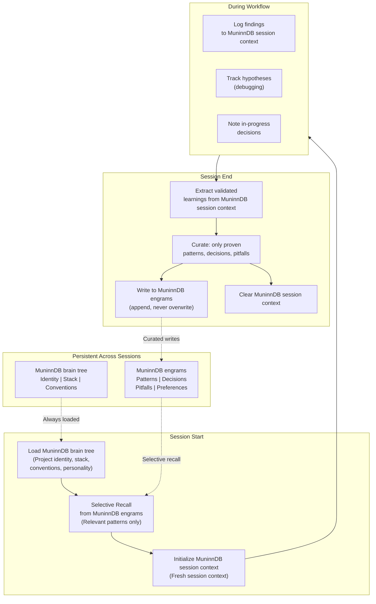

---

## 6. Iterative Execution Loop (Ralph Wiggum Pattern)

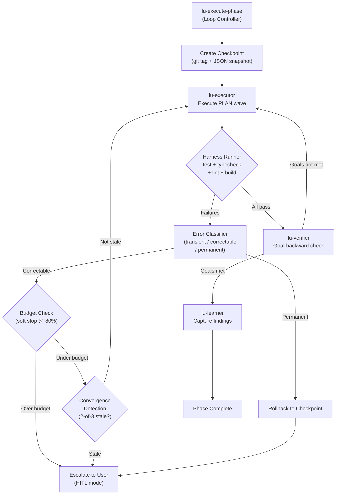

---

## 7. Usage-Aware Sprint Planner

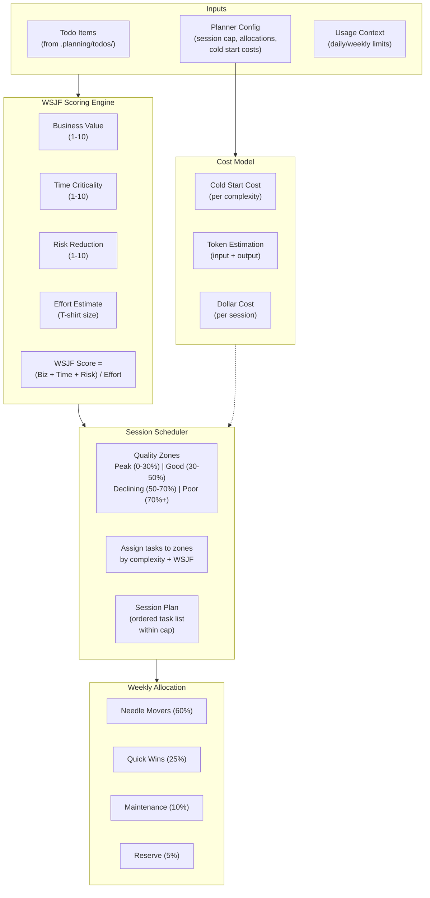

---

## 8. Context Tier System

```mermaid
flowchart LR
    subgraph Tiers["Context Tiers"]
        T0["T0: Minimal<br/>Agent name + role only"]
        T1["T1: Warm Start<br/>+ MuninnDB brain tree<br/>+ Selective MEMORY recall"]
        T2["T2: Full<br/>+ MuninnDB session context<br/>+ Project docs<br/>+ Phase plans"]
        T3["T3: Extended<br/>+ Codebase analysis<br/>+ Deep research"]
    end

    subgraph Promotion["Tier Promotion Rules"]
        RULE1["TRIVIAL/SIMPLE<br/>complexity = T0-T1"]
        RULE2["MODERATE<br/>complexity = T1-T2"]
        RULE3["COMPLEX/CRITICAL<br/>complexity = T2-T3"]
        RULE4["High risk intuition<br/>flags = Upgrade +1 tier"]
    end

    subgraph Isolation["Sub-Agent Isolation"]
        WARM["Warm Isolation<br/>Shared memory, scoped docs"]
        COLD["Cold Isolation<br/>Fresh context per agent"]
        NONE["No Isolation<br/>Full shared context"]
    end

    Tiers --> Promotion
    Promotion --> Isolation
```

---

## 9. Build & Drift Detection Pipeline

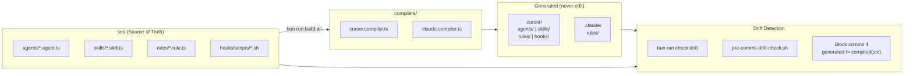

---

## 10. End-to-End Request Lifecycle

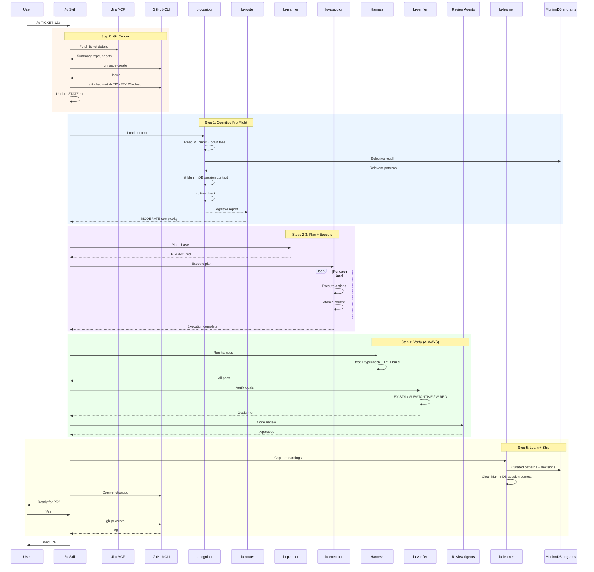

---

## 11. .planning/ State File Organization

```mermaid
flowchart TB
    subgraph Planning[".planning/"]
        subgraph Identity["Project Identity (Persistent)"]
            BRAIN["MuninnDB brain tree<br/>Stack, conventions,<br/>personality"]
            PROJECT["PROJECT.md<br/>Vision, scope,<br/>constraints"]
        end

        subgraph Memory["Memory (Persistent)"]
            MEM["MuninnDB engrams<br/>Patterns, decisions,<br/>pitfalls, preferences"]
        end

        subgraph Session["Session State"]
            STATE["STATE.md<br/>Current focus, git context,<br/>cognitive state, blockers"]
            WORKING["MuninnDB session context<br/>Current task, findings,<br/>hypotheses, notes"]
            CONFIG["config.json<br/>Harness, iteration,<br/>complexity, planner"]
        end

        subgraph Structure["Project Structure"]
            REQS["REQUIREMENTS.md"]
            ROADMAP["ROADMAP.md"]
        end

        subgraph Phases["phases/"]
            PH_N["phase-N/"]
            PLANS["PLAN-*.md"]
            SUMMARIES["SUMMARY-*.md"]
            VERIFICATION["VERIFICATION.md"]
            LEARNINGS["LEARNINGS.md"]
            CONTEXT["CONTEXT.md"]
            RESEARCH["RESEARCH.md"]
        end

        subgraph Utilities["Utilities"]
            TODOS["todos/"]
            DEBUG["debug/"]
            CODEBASE["codebase/"]
            QUICK["quick/"]
            MILESTONES["milestones/"]
        end
    end

    Identity --> Session --> Structure --> Phases
    Memory -.->|"Recalled at<br/>session start"| Session
    Phases -.->|"Learnings<br/>extracted"| Memory
```

---

## 12. Harness Verification Pipeline

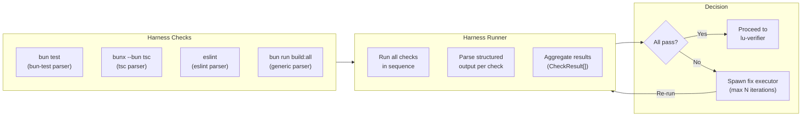
