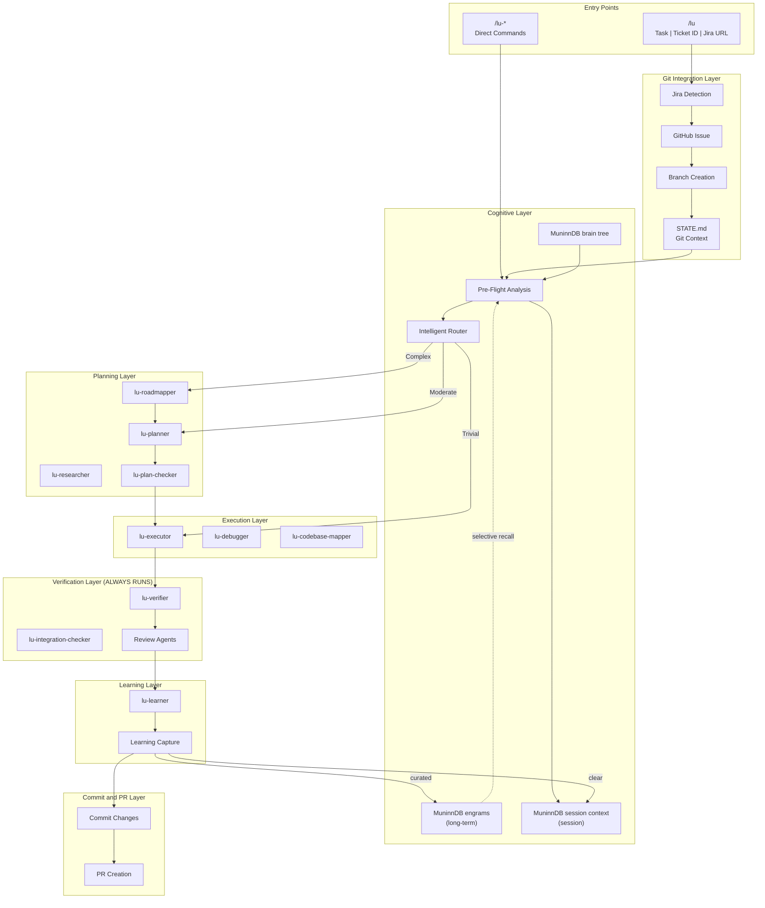
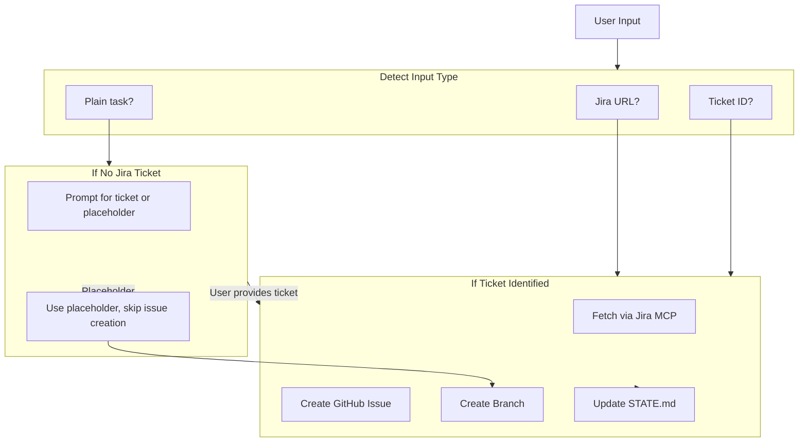
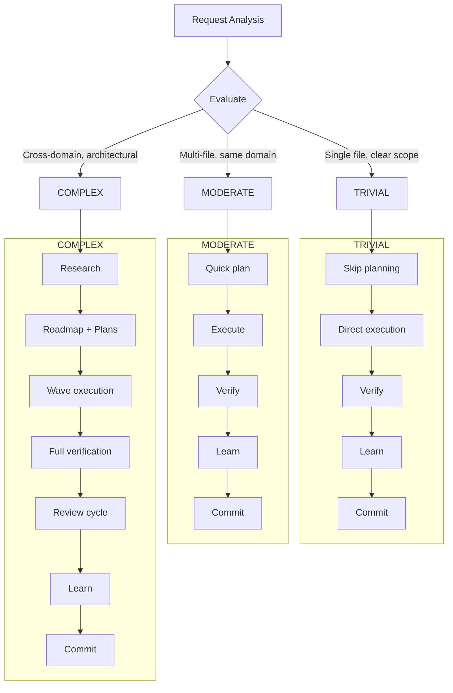
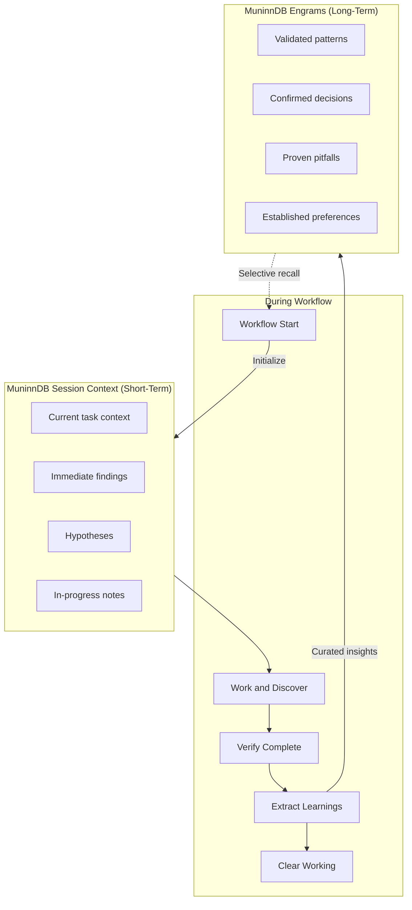
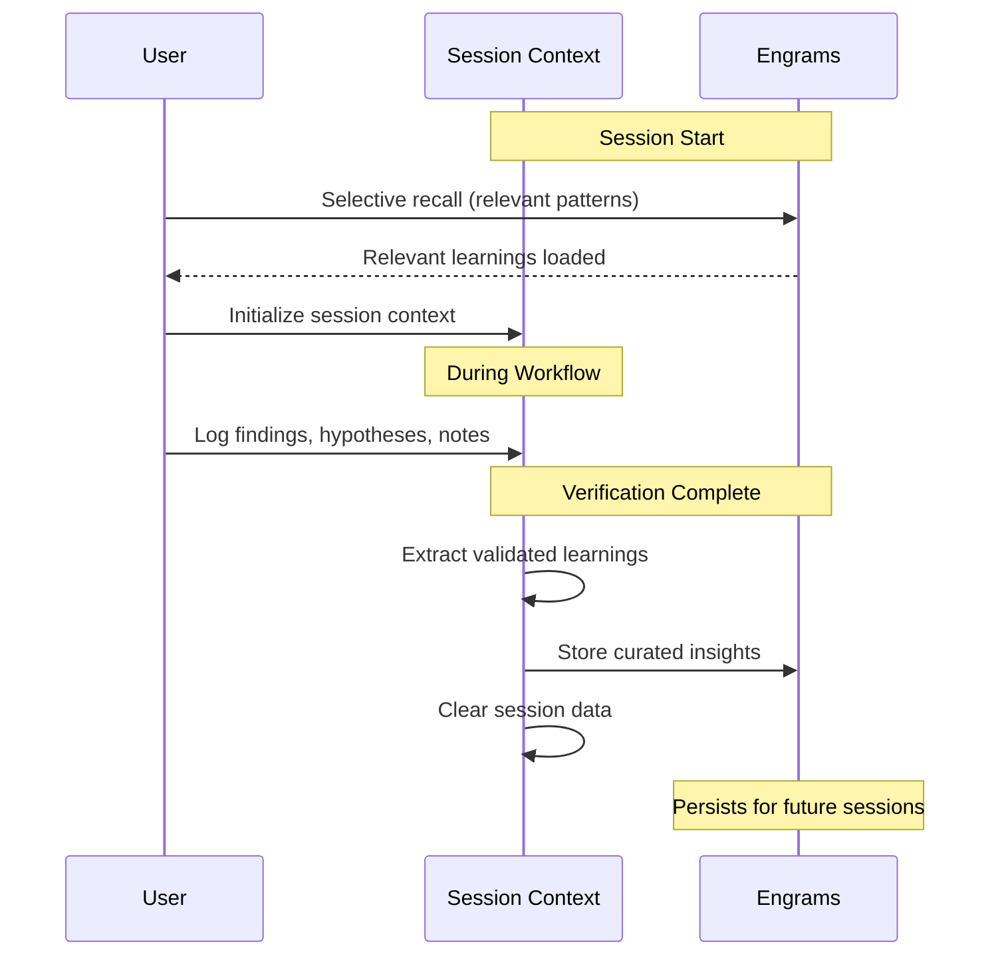

# Agent Framework Architecture

Luca is a spec-driven AI development framework with cognitive memory, intelligent routing, and integrated git workflow. It provides a unified entry point (`/lu`) that handles the full lifecycle from ticket intake through planning, execution, verification, learning capture, and PR creation.

---

## System Architecture

The framework is organized into seven layers, each backed by dedicated agents.



---

## Agent Hierarchy

Agents are organized into tiers that execute sequentially through the workflow.

| Tier | Role            | Agents                                                                                         |
| ---- | --------------- | ---------------------------------------------------------------------------------------------- |
| 0    | Git Integration | Handled by `/lu` skill (Jira detection, issue creation, branch management, STATE.md update)    |
| 1    | Cognitive       | `lu-cognition` (pre-flight analysis), `lu-router` (complexity routing)                         |
| 2    | Planning        | `lu-roadmapper`, `lu-planner`, `lu-*-researcher`, `lu-research-synthesizer`, `lu-plan-checker` |
| 3    | Execution       | `lu-executor`, `lu-debugger`, `lu-codebase-mapper`                                             |
| 4    | Verification    | `lu-verifier`, `lu-integration-checker`                                                        |
| 5    | Review          | `dx-advocate`, `code-simplifier`, `security-auditor` (external, run in parallel)               |
| 6    | Learning        | `lu-learner` (extract patterns, decisions, pitfalls, preferences into MuninnDB engrams)        |
| 7    | Commit and PR   | Handled by `/lu` skill (stage, commit, offer PR creation)                                      |

---

## End-to-End Workflow

### Step 0: Git Context Setup

The `/lu` entry point accepts a Jira URL, ticket ID, or plain task description.



### Step 1: Cognitive Pre-Flight

Runs before routing, planning, execution, and debugging operations.

1. **Memory Recall** -- Query MuninnDB engrams for similar tasks, relevant patterns, previous decisions, and known pitfalls.
2. **Intuition Check** -- Flag potential risks, uncertainty areas, scope concerns, and dependencies.
3. **Feel Awareness** -- Load user preferences, project conventions from MuninnDB brain tree, and communication style.
4. **Reason Analysis** -- Evaluate logical approach, dependency order, scope appropriateness, and recommend complexity level.

Output: Cognitive report with routing recommendation, memory context, intuition flags, and conventions.

### Step 2: Complexity Routing



Verification runs at all complexity levels. It is never skipped.

### Step 3: Planning (if needed)

For MODERATE tasks, an inline plan is created. For COMPLEX tasks, the full pipeline runs: research phase, goal-backward analysis, multi-wave PLAN.md creation, and plan validation via `lu-plan-checker`.

### Step 4: Execution

For each task in a plan:

1. Read the task goal, artifacts, and actions.
2. Handle checkpoints (human-verify, decision, human-action).
3. Execute actions (create/modify files, run commands, wire integrations).
4. Verify the task (EXISTS, SUBSTANTIVE, WIRED).
5. Handle deviations (auto-fix bugs, auto-add missing items, ASK for architecture changes).
6. Atomic commit.

### Step 5: Verification (always runs)

Three-level verification: EXISTS (do files exist?), SUBSTANTIVE (is the code correct?), WIRED (is it connected to the system?). Review agents (`dx-advocate`, `code-simplifier`, `security-auditor`) run in parallel.

### Step 6: Learning Capture

After verification, `lu-learner` extracts validated insights from the MuninnDB session context:

- **Patterns** -- Approaches and code patterns that worked.
- **Decisions** -- Architectural choices with rationale.
- **Pitfalls** -- Issues encountered and what to avoid.
- **Preferences** -- User feedback and conventions that emerged.

Curated learnings are written to MuninnDB engrams. Session context is cleared.

### Step 7: Commit and PR

Stage changes, commit with proper format, and offer PR creation linked to the Jira ticket and GitHub issue.

---

## Two-Tier Memory System



### Session Context (MuninnDB session context)

Active context during a workflow run. Tracks the current task, immediate findings, hypotheses, and in-progress notes. Created at workflow start, used throughout, cleared on completion.

### Long-Term Memory (MuninnDB engrams)

Persistent learnings that compound across sessions. Contains validated patterns, confirmed decisions, proven pitfalls, and established preferences. Selectively recalled based on relevance to the current task -- not loaded in bulk.

### Cross-Session Memory Flow



### MuninnDB Brain Tree

Stored as a persistent tree in MuninnDB (`brain:project-identity`), recalled at session start. Contains project identity (name, domain, purpose), stack (languages, frameworks), architecture patterns, code conventions, and development preferences.

---

## State Management

All workflow state lives in `.planning/`:

```
.planning/
  config.json        -- Workflow preferences (model profile, cognitive settings, gates)
  STATE.md           -- Session state including git context (ticket, issue, branch, base branch)
  PROJECT.md         -- Vision and scope
  ROADMAP.md         -- Phase structure with success criteria
  REQUIREMENTS.md    -- Detailed requirements per milestone
  todos/             -- Captured ideas and tasks
  phases/            -- Execution plans (PLAN-*.md, SUMMARY-*.md, VERIFICATION.md)
```

STATE.md tracks git context throughout the workflow:

```markdown
## Git Context

- Ticket: PROJ-1234
- GitHub Issue: #456
- Branch: PROJ-1234--fix-performance-issue
- Base Branch: ENG-1353--release
- Task Complexity: MODERATE
```

---

## Model Profile Integration

Agents receive different model tiers depending on the configured profile:

| Agent         | quality | balanced | budget |
| ------------- | ------- | -------- | ------ |
| lu-cognition  | opus    | sonnet   | haiku  |
| lu-planner    | opus    | opus     | sonnet |
| lu-roadmapper | opus    | sonnet   | sonnet |
| lu-executor   | opus    | sonnet   | sonnet |
| lu-verifier   | sonnet  | sonnet   | haiku  |
| lu-debugger   | opus    | sonnet   | sonnet |
| lu-learner    | sonnet  | haiku    | haiku  |

When cognitive pre-flight detects high complexity or risk, the model profile is upgraded one tier. When memory recall finds similar past successes, a downgrade may apply (confidence boost).

---

## Integration Points

| Category      | Integration                                                                          |
| ------------- | ------------------------------------------------------------------------------------ |
| Jira          | Read-only via Atlassian MCP (`getJiraIssue`, `searchJiraIssuesUsingJql`)             |
| GitHub        | Issue creation, branch management, PR creation via `gh` CLI                          |
| Review Agents | `dx-advocate`, `code-simplifier`, `security-auditor` run in parallel after execution |
| Hooks         | `post-edit-typecheck` (async, per-edit), `pre-commit-gate` (blocking, per-commit)    |
| Harness       | Comprehensive verification at phase boundaries (test + typecheck + lint + build)     |

---

## Key Commands

| Command                 | Purpose                                                                  |
| ----------------------- | ------------------------------------------------------------------------ |
| `/lu <task or ticket>`  | Unified entry: git setup, routing, execution, verification, learning, PR |
| `/lu-new-project`       | Initialize project with brain tree and engrams                           |
| `/lu-map-codebase`      | Analyze existing codebase (parallel agents)                              |
| `/lu-new-milestone`     | Start new milestone cycle                                                |
| `/lu-plan-phase [N]`    | Create execution plans with cognitive pre-flight                         |
| `/lu-execute-phase [N]` | Execute, verify, and capture learnings                                   |
| `/lu-debug`             | Memory-aided debugging with scientific method                            |
| `/lu-progress`          | Check current state and next steps                                       |
| `/lu-resume-work`       | Resume from previous session with context restoration                    |
| `/lu-address-pr`        | Address PR review comments with agent swarm                              |

### Unified Entry Flags

| Flag              | Purpose                                                   |
| ----------------- | --------------------------------------------------------- |
| `--force-complex` | Force full planning pipeline regardless of classification |
| `--skip-memory`   | Skip memory recall (fresh start)                          |
| `--skip-branch`   | Skip branch creation (use current branch)                 |
