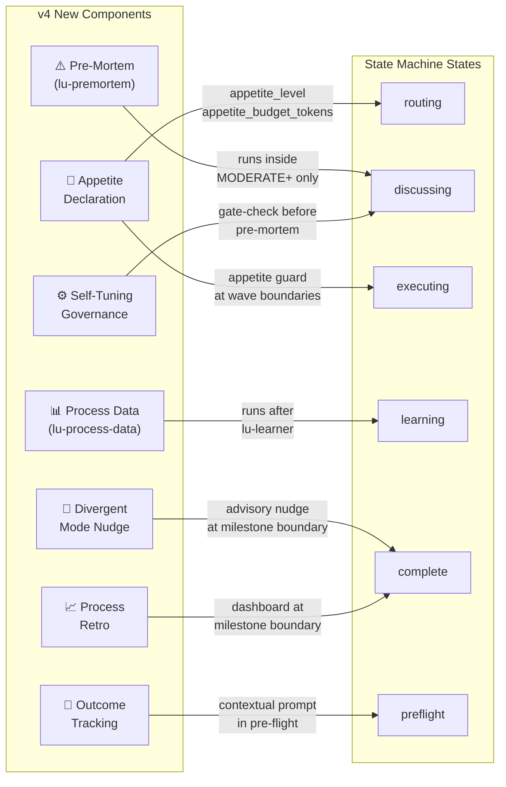

# v4 Workflow ↔ State Machine Diagram

## Pipeline → State Machine Mapping

```mermaid
stateDiagram-v2
    direction TB

    %% ─────────────────────────────────────────────
    %% PHASE 0: INTAKE & APPETITE
    %% ─────────────────────────────────────────────
    state "Phase 0: Intake & Appetite" as P0 {
        [*] --> idle
        idle --> preflight : START
        preflight --> routing : PREFLIGHT_COMPLETE

        state idle {
            note right of idle
                Waiting for task.
                5-min idle timeout → failed.
            end note
        }

        state preflight {
            note right of preflight
                Cognitive pre-flight (lu-cognition)
                ● Recall brain tree from MuninnDB
                ● Semantic recall (patterns, pitfalls, decisions)
                ● Generate intuition flags (RISK, CAUTION, etc.)
                ─── v4 NEW ───
                ● Recall outcome:* + process:* engrams
                ● Contextual outcome prompt
                  ("Did Feature X achieve its goal?")
            end note
        }

        state routing {
            note right of routing
                Complexity classification (lu-router)
                ─── v4 NEW ───
                ● Appetite declaration
                  TRIVIAL/SIMPLE → auto (Micro/Small)
                  MODERATE+ → developer declares
                  (Micro/Small/Medium/Large/XL)
                ● Store appetite_level,
                  appetite_budget_tokens in context
            end note
        }
    }

    %% ─────────────────────────────────────────────
    %% PHASE 1: PRE-MORTEM (MODERATE+ only)
    %% ─────────────────────────────────────────────
    state "Phase 1: Pre-Mortem" as P1 {
        state discussing {
            note right of discussing
                ─── v4 NEW (MODERATE+ only) ───
                lu-premortem agent:
                ● 3 domain-specific failure scenarios
                ● Novelty-enforced (no boilerplate)
                ● Seeded with past failures from MuninnDB
                ● → Risk Brief (≤500 words)
                ● CHECKPOINT 1: developer approve/reject
                ● Approved mitigations → plan constraints
                ● Verification criteria → harness
                ─────
                Model: DEEP_ANALYSIS
                Cost: ~$0.25-0.50 (MODERATE+), $0 (TRIVIAL/SIMPLE)
                Skipped: TRIVIAL/SIMPLE
            end note
        }
    }

    %% ─────────────────────────────────────────────
    %% PHASE 2: PLANNING
    %% ─────────────────────────────────────────────
    state "Phase 2: Planning" as P2 {
        state planning {
            note right of planning
                PLAN.md creation (lu-planner)
                ● Pattern application from recalled memory
                ● Decision respect from past choices
                ─── v4 NEW ───
                ● Appetite constraint shapes scope
                  (cut to fit token budget)
                ● Pre-mortem mitigations baked into tasks
                ● Plan verification (1/1/1/2/3 iterations)
            end note
        }
    }

    %% ─────────────────────────────────────────────
    %% PHASE 3: EXECUTION
    %% ─────────────────────────────────────────────
    state "Phase 3: Execution" as P3 {
        state executing {
            state "phaseActor (child machine)" as PA {
                pa_idle: wave setup
                wave_executing: wave N running
                wave_evaluating: evaluate results

                pa_idle --> wave_executing : PLAN_WAVE / auto
                wave_executing --> wave_evaluating : WAVE_COMPLETE / WAVE_FAILED
                wave_evaluating --> wave_executing : [hasMoreWaves]
                wave_evaluating --> phase_verifying : [no more waves]

                state phase_verifying {
                    note left of phase_verifying
                        Harness: test + typecheck
                        + lint + build
                    end note
                }

                phase_verifying --> phase_done : HARNESS_PASSED
                phase_verifying --> phase_fixing : HARNESS_FAILED\n[withinFixBudget]
                phase_verifying --> phase_blocked : HARNESS_FAILED\n[budget exhausted]
                phase_fixing --> phase_verifying : FIX_COMPLETE
                phase_fixing --> phase_blocked : FIX_FAILED
            }

            note right of executing
                Wave-based parallel execution
                ─── v4 NEW ───
                ● Appetite guard at wave boundaries
                  80% → warning, continue
                  100% → PAUSE:
                    (a) Extend budget
                    (b) Scope-cut
                    (c) Halt + preserve
                ● Never interrupts mid-wave
                ● Model: ROUTER preset
            end note
        }
    }

    %% ─────────────────────────────────────────────
    %% PHASE 4: VERIFICATION
    %% ─────────────────────────────────────────────
    state "Phase 4: Verification" as P4 {
        state verifying {
            note right of verifying
                ● Harness: test + typecheck + lint + build
                ● lu-verifier: EXISTS / SUBSTANTIVE / WIRED
                ● Code review: 5 parallel reviewers
                ─── v4 NEW ───
                ● Pre-mortem mitigations as
                  additional review criteria
                ● CHECKPOINT 2: developer reviews
                  verification summary (~2-3 min)
            end note
        }
    }

    %% ─────────────────────────────────────────────
    %% PHASE 5: LEARNING & PROCESS DATA
    %% ─────────────────────────────────────────────
    state "Phase 5: Learning & Process Data" as P5 {
        state learning {
            note right of learning
                lu-learner: patterns, decisions,
                pitfalls → MuninnDB
                ─── v4 NEW ───
                lu-process-data agent (sequential):
                ● Appetite accuracy (declared vs actual)
                ● Rework ratio (fix iterations / total)
                ● Pre-mortem signal rate
                ● DORA metrics (COMPLEX+ only):
                  lead time, change failure rate
                ● Self-tuning: if signal rate <10%
                  over 20 runs → auto-skip pre-mortem
                ─────
                Model: FAST_PROMOTED ($0.003/run)
            end note
        }
    }

    %% ─────────────────────────────────────────────
    %% PHASE 6: COMMIT
    %% ─────────────────────────────────────────────
    state "Phase 6: Commit" as P6 {
        state committing
        state complete

        committing --> idle : COMMIT_COMPLETE\n[hasMorePhases]
        committing --> complete : COMMIT_COMPLETE\n[final phase]
    }

    %% ─────────────────────────────────────────────
    %% ERROR / INTERRUPT STATES
    %% ─────────────────────────────────────────────
    state "Interrupts" as INT {
        state paused {
            note right of paused
                Human intervention required.
                Entered on VERIFY_HALTED
                or phaseActor error.
            end note
        }
        state suspended {
            note right of suspended
                Checkpoint-based suspend.
                Preserves wave progress.
            end note
        }
        state failed
    }

    %% ─────────────────────────────────────────────
    %% MAIN FLOW TRANSITIONS
    %% ─────────────────────────────────────────────
    routing --> discussing : ROUTE_COMPLETE\n[shouldRunDiscussion]
    routing --> planning : ROUTE_COMPLETE\n[skip discussion]
    discussing --> planning : DISCUSS_COMPLETE
    planning --> executing : PLAN_COMPLETE
    executing --> verifying : PHASE_COMPLETE / onDone
    verifying --> learning : VERIFY_PASSED\n[shouldCaptureLearnings]
    verifying --> committing : VERIFY_PASSED\n[skip learning]
    learning --> committing : LEARN_COMPLETE

    %% RETRY LOOP
    verifying --> executing : VERIFY_FAILED\n[canRetry]

    %% INTERRUPT TRANSITIONS
    executing --> suspended : SUSPEND
    executing --> paused : phaseActor error
    verifying --> paused : VERIFY_HALTED
    verifying --> failed : VERIFY_FAILED\n[max retries]

    %% RECOVERY TRANSITIONS
    paused --> executing : RESUME
    suspended --> executing : RESUME_PHASE
    paused --> idle : ABORT
    suspended --> idle : ABORT / RESET
    failed --> idle : RESET
```

## v4 Additions Summary



## Developer Attention Budget

```mermaid
flowchart TB
    subgraph "TRIVIAL / SIMPLE — 0 min (fully autonomous)"
        T1[Intake] --> T2[Planning] --> T3[Execution] --> T4[Verification] --> T5[Learning] --> T6[Commit]
    end

    subgraph "MODERATE+ — ~5-7 min developer time"
        M0["Appetite Declaration\n(developer declares)"] --> M1["Risk Brief Review\n◄ CHECKPOINT 1\n~2-3 min"]
        M1 --> M2[Planning] --> M3[Execution] --> M4["Verification Summary\n◄ CHECKPOINT 2\n~2-3 min"]
        M4 --> M5[Learning + Process Data] --> M6[Commit]
    end

    subgraph "Milestone Boundary — ~1 min"
        MB1["Process Retro\n~1 min (optional)"]
        MB2["Divergent Mode Nudge\n(8+ milestones)"]
    end

    subgraph "Contextual — ~15 sec"
        OT["Outcome Tracking\n'Did Feature X achieve its goal?'\nyes / no / too early"]
    end
```


