# Agent Orchestration

How skills spawn agents and how agents chain together.

```mermaid
flowchart TD
    subgraph Skills["Skills (User-Facing Commands)"]
        S1["/autopilot"]
        S2["/phase-plan"]
        S3["/phase-execute"]
        S4["/phase-discuss"]
        S5["/milestone-complete"]
    end

    subgraph Planning["Planning Agents"]
        A1["lu-router"]
        A2["lu-phase-researcher"]
        A3["lu-planner"]
        A4["lu-plan-checker"]
        A5["lu-pm-planner"]
    end

    subgraph Execution["Execution Agents"]
        A6["lu-executor"]
        A7["lu-test-writer"]
        A8["lu-verifier"]
        A9["lu-learner"]
    end

    subgraph Review["Review Agents"]
        A10["code-architect"]
        A11["code-simplifier"]
        A12["dx-advocate"]
        A13["security-auditor"]
    end

    subgraph Research["Research Agents"]
        A14["lu-discuss-researcher"]
        A15["lu-project-researcher"]
        A16["lu-research-synthesizer"]
    end

    subgraph Cognition["Cognition Agents"]
        A17["lu-cognition"]
    end

    S1 -->|"classify complexity"| A1
    S1 -->|"plan phases"| S2
    S1 -->|"execute phases"| S3
    S1 -->|"discuss phases"| S4
    S1 -->|"backlog scoring"| A5

    S2 -->|"research"| A2
    S2 -->|"create plans"| A3
    S2 -->|"verify plans"| A4

    S3 -->|"execute tasks"| A6
    A6 -->|"TDD: generate tests"| A7
    S3 -->|"verify results"| A8
    S3 -->|"extract learnings"| A9
    S3 -->|"code review"| A10
    S3 -->|"code review"| A11
    S3 -->|"code review"| A12

    S4 -->|"--auto: research questions"| A14

    S1 -->|"cognitive pre-flight"| A17

    style S1 fill:#4a9eff,color:#fff
    style S2 fill:#4a9eff,color:#fff
    style S3 fill:#4a9eff,color:#fff
    style S4 fill:#4a9eff,color:#fff
    style S5 fill:#4a9eff,color:#fff
```

## Agent Categories

| Category  | Agents                                                                     | Purpose                                                          |
| --------- | -------------------------------------------------------------------------- | ---------------------------------------------------------------- |
| Planning  | lu-router, lu-phase-researcher, lu-planner, lu-plan-checker, lu-pm-planner | Classify, research, create, and verify plans                     |
| Execution | lu-executor, lu-test-writer, lu-verifier, lu-learner                       | Execute tasks, generate tests, verify results, capture learnings |
| Review    | code-architect, code-simplifier, dx-advocate, security-auditor             | Code quality gates                                               |
| Research  | lu-discuss-researcher, lu-project-researcher, lu-research-synthesizer      | Web research and synthesis                                       |
| Cognition | lu-cognition                                                               | Memory management and pre-flight                                 |

## Spawning Rules

- **Skills** spawn agents via `Task()` — agents cannot spawn skills
- **Agents** can spawn other agents via `Task()` — e.g., lu-executor spawns lu-test-writer
- **Autopilot** is a meta-orchestrator that chains skills in a loop
- **Review agents** are complexity-gated — only spawn at MODERATE+ complexity
