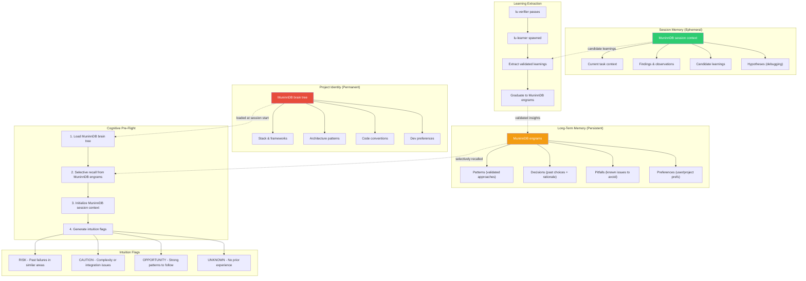

# Cognition Flow

Two-tier memory system: project identity, long-term learning, and session memory.

## Memory Tiers

| Tier      | File                     | Scope                   | Lifetime   | Updated By               |
| --------- | ------------------------ | ----------------------- | ---------- | ------------------------ |
| Identity  | MuninnDB brain tree      | Project conventions     | Permanent  | /project-new, user edits |
| Long-Term | MuninnDB engrams         | Cross-session learnings | Persistent | lu-learner (validated)   |
| Session   | MuninnDB session context | Current session context | Ephemeral  | lu-executor, lu-verifier |

## Data Flow

1. **Session Start**: lu-cognition runs pre-flight — loads MuninnDB brain tree, recalls relevant MuninnDB engrams entries, initializes MuninnDB session context
2. **During Execution**: lu-executor logs findings, observations, and candidate learnings to MuninnDB session context
3. **After Verification**: lu-learner extracts validated insights from MuninnDB session context → graduates to MuninnDB engrams
4. **At Milestone**: MuninnDB engrams snapshot archived, MuninnDB session context cleared for next milestone
