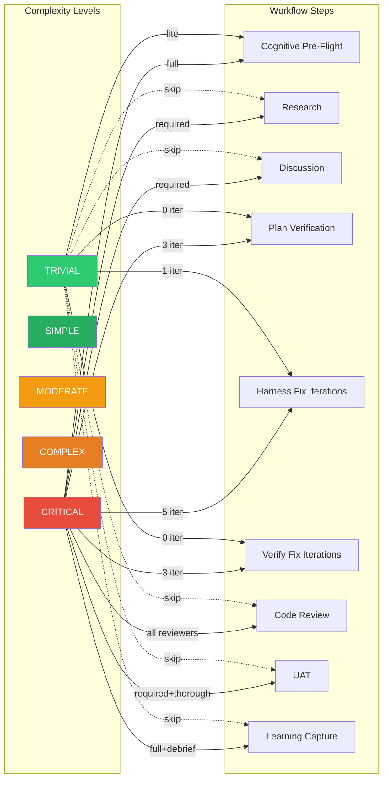

# Complexity Gates

Which workflow steps activate at each complexity level.

## Full Complexity Matrix

| Step                          | TRIVIAL | SIMPLE | MODERATE | COMPLEX  | CRITICAL          |
| ----------------------------- | ------- | ------ | -------- | -------- | ----------------- |
| Cognitive pre-flight          | Lite    | Lite   | Full     | Full     | Full              |
| Research                      | Skip    | Skip   | Optional | Required | Required          |
| Discussion                    | Skip    | Skip   | Optional | Run      | Required          |
| Plan verification             | 0 iter  | 0 iter | 1 iter   | 2 iter   | 3 iter            |
| Harness fix iterations        | 1       | 2      | 3        | 3        | 5                 |
| Verify fix iterations         | 0       | 1      | 1        | 2        | 3                 |
| Verification mode             | Quick   | Quick  | Standard | Full     | Full+Human        |
| Code review: dx-advocate      | Skip    | Skip   | Run      | Run      | Run               |
| Code review: code-simplifier  | Skip    | Skip   | Run      | Run      | Run               |
| Code review: code-architect   | Skip    | Skip   | Skip     | Run      | Run               |
| Code review: tailwind-auditor | Skip    | Skip   | If UI    | If UI    | Run               |
| Code review: security-auditor | Skip    | Skip   | If auth  | If auth  | Always            |
| UAT                           | Skip    | Skip   | Optional | Required | Required+Thorough |
| Learning capture              | Skip    | Brief  | Standard | Full     | Full+Debrief      |

## Behavioral Tiers

| Tier        | Levels            | Behavior                                                                                            |
| ----------- | ----------------- | --------------------------------------------------------------------------------------------------- |
| Lightweight | TRIVIAL, SIMPLE   | Minimal overhead. Skip research, discussion, code review, UAT. Fast iteration.                      |
| Standard    | MODERATE          | Balanced. Optional research/discussion, standard verification, basic code review.                   |
| Thorough    | COMPLEX, CRITICAL | Maximum rigor. Required research, discussion, full verification, all reviewers, UAT, full learning. |

## Override Mechanisms

- `--complexity=<level>` — Explicit level, skips router inference
- `--force-complex` — Alias for `--complexity=COMPLEX`
- `workflow.code_review: false` — Skip code review regardless of complexity
- `workflow.uat_required: false` — Skip UAT regardless of complexity
- `--skip-review`, `--skip-uat` — Per-invocation skip flags

Config booleans and per-invocation flags take precedence over complexity gating.
