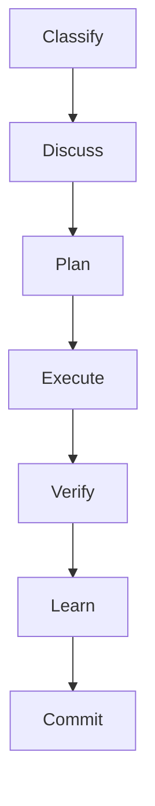
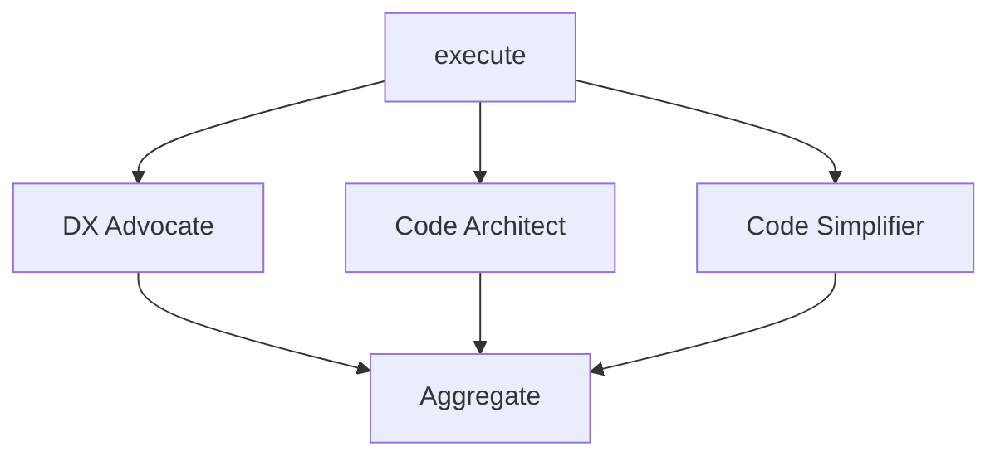

# Research: DAG Workflow Engines in TypeScript

**Domain:** DAG workflow orchestration for agentic development tooling
**Researched:** 2026-03-23
**Overall confidence:** HIGH (multiple sources cross-referenced, patterns validated against production systems)

## Executive Summary

The TypeScript DAG workflow engine landscape in 2026 is bifurcated: heavyweight production systems (Temporal, Inngest, DBOS) that require external infrastructure, and lightweight libraries (ts-edge, typescript-graph, workflows-ts) that are too thin to provide meaningful value. No existing library matches Luca's requirements of typed step contracts with Zod validation, in-process execution through pluggable adapters, functional API patterns (no classes), checkpoint/resume via JSON serialization, and Mermaid visualization. The recommendation is to **build from scratch**, borrowing specific design patterns from Temporal (deterministic replay, activity/workflow separation), Inngest (step-level memoization, generator-like pause/resume), and Mastra (Zod step contracts, fluent builder API, `.build()` finalization). The core algorithm -- Kahn's topological sort with wave grouping for parallel execution -- is well-understood (~100 lines of TypeScript) and does not warrant a dependency.

---

## 1. Existing TypeScript DAG/Workflow Libraries

### 1.1 Heavyweight Production Systems (Not Adoptable)

These are the gold standard for workflow orchestration but require external infrastructure that violates Luca's "no heavy dependencies" constraint.

| Library                                                          | Stars | Last Update   | Requires                                           | Why Not                                                              |
| ---------------------------------------------------------------- | ----- | ------------- | -------------------------------------------------- | -------------------------------------------------------------------- |
| [Temporal TS SDK](https://github.com/temporalio/sdk-typescript)  | 500+  | Active (2026) | Temporal Server (Go binary + PostgreSQL/Cassandra) | Infrastructure dependency; overkill for single-process orchestration |
| [Inngest](https://github.com/inngest/inngest)                    | 4.5k+ | Active (2026) | Inngest Cloud or self-hosted server                | SaaS/server dependency; designed for serverless, not in-process      |
| [DBOS Transact-TS](https://github.com/dbos-inc/dbos-transact-ts) | 1.1k  | Mar 2026      | PostgreSQL                                         | Database dependency; cannot run in-process without Postgres          |
| [Windmill](https://windmill.dev)                                 | 10k+  | Active (2026) | Self-hosted server                                 | Full platform; DAGs defined in YAML, not TypeScript                  |
| [Trigger.dev](https://trigger.dev)                               | 8k+   | Active (2026) | Trigger.dev platform                               | SaaS dependency; designed for cloud execution                        |

**Confidence: HIGH** -- verified via GitHub repos and official documentation.

### 1.2 Lightweight Libraries (Too Thin)

These are embeddable but lack the features Luca needs.

| Library                                                                                   | Stars | Key Features                                                  | Missing for Luca                                                                                                    |
| ----------------------------------------------------------------------------------------- | ----- | ------------------------------------------------------------- | ------------------------------------------------------------------------------------------------------------------- |
| [ts-edge](https://github.com/cgoinglove/ts-edge)                                          | 26    | Type-safe graph execution, fluent API, merge nodes for fan-in | No retry, no checkpoint/resume, no Zod integration, no topological sort (manual edge wiring), class-based internals |
| [ts-dag](https://github.com/walleXD/ts-dag)                                               | 7     | DAG builder + visualizer packages                             | Barely maintained, no parallel execution, no schema validation                                                      |
| [workflows-ts (LlamaIndex)](https://github.com/run-llama/workflows-ts)                    | 256   | Event-driven, stream-oriented, <=2kb core                     | Event-based not DAG-based; no dependency graph; designed for LLM streaming, not step orchestration                  |
| [typescript-graph](https://github.com/segfaultx64/typescript-graph)                       | 22    | DirectedAcyclicGraph class, topological sort, cycle detection | Graph data structure only; no execution, no workflow features; class-based API                                      |
| [ez-flow](https://dev.to/rstanziale/ez-flow-typescript-library-for-a-workflow-engine-l67) | Low   | Basic workflow engine                                         | Minimal features, low adoption                                                                                      |
| [Workflow-ES](https://danielgerlag.github.io/workflow-es/typescript-guide.html)           | 216   | Durable tasks, browser+Node compatible                        | Last updated Jan 2025; class-heavy API                                                                              |

**Confidence: HIGH** -- verified via GitHub repos and npm pages.

### 1.3 Utility Libraries (Potentially Useful as Micro-Dependencies)

| Library                                                                               | Purpose                                               | Value for Luca                                                                       |
| ------------------------------------------------------------------------------------- | ----------------------------------------------------- | ------------------------------------------------------------------------------------ |
| [topological-sort-group](https://www.npmjs.com/package/topological-sort-group)        | Groups topologically sorted nodes into parallel waves | Exactly the algorithm needed for wave grouping, but trivial to implement (~30 lines) |
| [incremental-cycle-detect](https://github.com/blutorange/js-incremental-cycle-detect) | Maintains topological order as edges are added        | Useful for incremental DAG building; prevents cycles on edge insertion               |
| [graphology-dag](https://www.npmjs.com/package/graphology-dag)                        | DAG utilities including hasCycle, topologicalSort     | Part of the graphology ecosystem; too heavy for just DAG utilities                   |

**Recommendation:** None of these warrant a dependency. The algorithms are straightforward to implement and keeping them in-house means zero supply chain risk and full control over the API.

**Confidence: HIGH** -- npm packages verified; algorithm complexity assessed.

---

## 2. DAG Execution Patterns

### 2.1 Topological Sort with Wave Grouping

The standard approach for DAG execution with parallelism is Kahn's algorithm modified to produce "waves" (also called "levels" or "layers"):

```
Algorithm: Wave-Grouped Topological Sort (Kahn's variant)

1. Compute in-degree for every node
2. Collect all nodes with in-degree 0 into wave[0]
3. For each wave:
   a. Execute all nodes in the wave in parallel (Promise.allSettled for fail-isolated semantics)
   b. For each completed node, decrement in-degree of successors
   c. Collect newly zero-in-degree nodes into the next wave
4. If any nodes remain unprocessed, the graph has a cycle (error)
```

This produces output like `[['A'], ['B', 'C'], ['D']]` where each inner array can execute in parallel. This is exactly what Luca needs for grouping independent steps (e.g., parallel code reviewers).

**Implementation cost:** ~60-80 lines of TypeScript. Not worth a dependency.

**Confidence: HIGH** -- well-established algorithm documented in Cormen et al. (CLRS), Wikipedia, and multiple TypeScript implementations.

### 2.2 Typed Step Contracts

The production pattern (Temporal, Mastra, Hatchet) is:

1. **Each step declares input/output schemas** (Zod in TS ecosystem)
2. **The DAG validator checks schema compatibility** at build time: step N's output schema must be a superset of step N+1's input schema
3. **Runtime validation** at step boundaries: parse input before execute, parse output after execute
4. **Type inference** flows through the builder API via generics

Mastra's approach is the closest match to Luca's needs:

```typescript
// Mastra pattern (borrowable)
const step = createStep({
  id: "step-1",
  inputSchema: z.object({ message: z.string() }),
  outputSchema: z.object({ formatted: z.string() }),
  execute: async ({ inputData }) => {
    return { formatted: inputData.message.toUpperCase() };
  },
});
```

Hatchet uses a similar pattern with Pydantic (Python), and Temporal uses plain TypeScript function signatures without runtime schema validation. Luca should follow Mastra's Zod-first approach since the codebase already uses Zod extensively.

**Confidence: HIGH** -- pattern verified across Mastra docs, Hatchet docs, and Temporal SDK docs.

### 2.3 Error Propagation

Three patterns observed across production engines:

| Pattern           | Used By           | How It Works                                                             |
| ----------------- | ----------------- | ------------------------------------------------------------------------ |
| **Fail-fast**     | Temporal, Hatchet | First step failure stops the workflow; downstream steps are cancelled    |
| **Fail-isolated** | Airflow, Windmill | Failed step marks itself failed; unrelated parallel branches continue    |
| **Fail-retry**    | Inngest, DBOS     | Failed step retries N times with backoff; workflow suspends during retry |

**Recommendation for Luca:** Combine fail-isolated (parallel branches continue) with per-step retry configuration. This matches the existing iteration system's convergence behavior.

### 2.4 Checkpoint/Resume

Three approaches for persisting DAG execution state:

| Approach             | Used By           | Storage                                                                              | Complexity             |
| -------------------- | ----------------- | ------------------------------------------------------------------------------------ | ---------------------- |
| **Event sourcing**   | Temporal          | Append-only event log in DB                                                          | High (requires replay) |
| **Step memoization** | Inngest, DBOS     | Step results stored after completion; function re-executes but skips completed steps | Medium                 |
| **State snapshot**   | LangGraph, Mastra | Serialize entire execution state to JSON                                             | Low (simplest)         |

**Recommendation for Luca:** State snapshot approach. Serialize the execution context (completed step results, current wave index, pending step IDs) to a JSON file in `.planning/`. This aligns with the existing `luca-bridge` state machine pattern and requires no external infrastructure.

```typescript
// Checkpoint schema (proposed)
const DAGCheckpointSchema = z.object({
  dagName: z.string(),
  dagVersion: z.string(),
  startedAt: z.string().datetime(),
  currentWave: z.number(),
  completedSteps: z.record(z.string(), z.any()), // stepId -> output
  skippedSteps: z.array(z.string()),
  failedSteps: z.record(
    z.string(),
    z.object({
      error: z.string(),
      retryCount: z.number(),
    }),
  ),
  context: z.record(z.string(), z.any()), // accumulated context
});
```

**Confidence: HIGH** -- patterns verified across Temporal docs, Inngest blog post on durable execution, and Microsoft Agent Framework docs.

---

## 3. Mastra's Workflow Engine

### 3.1 Architecture

Mastra (v1.0+, from the Gatsby team, 1.77M monthly NPM downloads) uses a graph-based state machine for workflow execution:

- Steps created via `createStep()` with Zod `inputSchema`/`outputSchema`
- Workflows composed via fluent API: `.then()`, `.branch()`, `.parallel()`
- Finalized with `.build()` (immutable after commit)
- Supports suspend/resume for human-in-the-loop workflows
- Supports nested workflows (workflow-as-step)

### 3.2 Step Definition API

```typescript
const doubleStep = createStep({
  id: "doubleStep",
  inputSchema: z.object({ inputValue: z.number() }),
  outputSchema: z.object({ doubledValue: z.number() }),
  execute: async ({
    context,
    inputData,
    getStepResult,
    getInitData,
    suspend,
  }) => ({
    doubledValue: context.inputData.inputValue * 2,
  }),
});
```

The `execute` function receives:

- `inputData` -- validated against inputSchema
- `getStepResult(step)` -- access results from prior steps
- `getInitData()` -- access initial workflow input
- `state/setState()` -- shared mutable state
- `suspend()` -- pause for human input
- `runId`, `retryCount` -- execution metadata

### 3.3 Workflow Composition

```typescript
const workflow = createWorkflow({
  id: "my-workflow",
  inputSchema: z.object({ value: z.number() }),
  outputSchema: z.object({ result: z.number() }),
})
  .then(stepA)
  .then(stepB, { when: ({ context }) => context.inputData.flag })
  .then(stepC)
  .build();
```

### 3.4 Patterns Worth Borrowing

| Pattern                            | What Mastra Does                         | Luca Adaptation                                                     |
| ---------------------------------- | ---------------------------------------- | ------------------------------------------------------------------- |
| **Zod step contracts**             | inputSchema/outputSchema on every step   | Adopt directly -- already in Luca's design doc                      |
| **Fluent builder with `.build()`** | Immutable DAG after commit               | Adopt -- prevents accidental mutation                               |
| **`getStepResult(step)`**          | Access prior step outputs by reference   | Adopt -- cleaner than passing accumulated context                   |
| **Suspend/resume**                 | `await suspend()` pauses for human input | Adapt for oversight gates (phase/milestone approval)                |
| **Workflow-as-step**               | Nest workflows for composition           | Useful for sub-workflows (e.g., execute phase has its own wave DAG) |

### 3.5 Patterns to Avoid

| Pattern               | Why Avoid                                                                                               |
| --------------------- | ------------------------------------------------------------------------------------------------------- |
| **Class-based Step**  | Mastra's `createStep` returns class instances internally; Luca uses functional patterns                 |
| **Implicit parallel** | Mastra infers parallelism from `when` conditions; Luca should use explicit `parallelGroups` for clarity |
| **Runtime framework** | Mastra manages its own execution loop with LLM API calls; Luca uses adapters                            |

**Confidence: HIGH** -- verified via Mastra official docs, step reference API, and deep-dive blog post.

---

## 4. Temporal and Inngest Patterns

### 4.1 Temporal: Deterministic Replay

Temporal's core innovation is **deterministic replay**: workflows are pure functions that orchestrate activities. Every decision is recorded in an event history. On failure, the workflow replays from the event history, skipping completed activities.

**Key patterns:**

```typescript
// Temporal pattern: Workflows are orchestrators, activities are executors
export async function orderWorkflow(order: Order): Promise<string> {
  const result = await validateOrder(order); // Activity 1
  const payment = await processPayment(result); // Activity 2
  await sendConfirmation(payment); // Activity 3
  return payment.id;
}
```

**Borrowable for Luca:**

- **Separation of concerns**: The DAG definition (workflow) is distinct from step execution (adapter). The DAG executor orchestrates; adapters execute.
- **Parallel via Promise.all**: `const [a, b] = await Promise.all([activityA(), activityB()])` -- simple, native JS pattern for fan-out/fan-in.
- **Type-first contracts**: Function signatures serve as implicit contracts. Luca makes this explicit with Zod schemas.

**Not borrowable:**

- Deterministic replay requires an event store and replay runtime -- too heavy for in-process execution.
- Worker/server architecture is infrastructure Luca explicitly avoids.

### 4.2 Inngest: Step-Level Memoization

Inngest's key insight is **each step is a retriable checkpoint**:

```typescript
// Inngest pattern: Steps as memoized checkpoints
export const myFunction = inngest.createFunction(
  { id: "my-fn" },
  { event: "app/event" },
  async ({ step }) => {
    const data = await step.run("fetch-data", async () => {
      return fetchFromAPI();
    });

    const result = await step.run("process-data", async () => {
      return processData(data);
    });

    return result;
  },
);
```

**Borrowable for Luca:**

- **Step memoization**: On resume, completed steps return cached results without re-executing. Luca's checkpoint schema stores `completedSteps: Record<stepId, output>`.
- **Generator-like semantics**: The workflow function "yields" at each step boundary. On resume, it fast-forwards through memoized steps.
- **`Promise.all` for parallelism**: `await Promise.all([step.run("a", fnA), step.run("b", fnB)])` -- same native pattern as Temporal.

**Not borrowable:**

- Inngest's durable execution requires the Inngest platform for state persistence. Luca uses local JSON files.
- Event-driven triggers are unnecessary for Luca's orchestrator-invoked model.

### 4.3 Synthesis: What to Steal

| Pattern                          | From     | Implementation in Luca                                                      |
| -------------------------------- | -------- | --------------------------------------------------------------------------- |
| Workflow/Activity separation     | Temporal | DAG definition vs. adapter execution                                        |
| Step memoization on resume       | Inngest  | `completedSteps` in checkpoint JSON                                         |
| `Promise.allSettled` for fan-out | Both     | Wave executor runs parallel steps with `Promise.allSettled` (fail-isolated) |
| Typed function signatures        | Temporal | Zod schemas on steps (more explicit)                                        |
| Step-level retry with backoff    | Both     | `retry: { max, backoff }` on step config                                    |
| Cancellation propagation         | Temporal | `AbortController` per step, cancelled on workflow abort                     |

**Confidence: HIGH** -- patterns verified against Temporal TS SDK docs, Inngest docs, and Inngest durable execution blog post.

---

## 5. Mermaid Diagram Generation

### 5.1 Approach

Mermaid flowchart syntax is simple enough that **string templating is sufficient** -- no library needed. The syntax maps directly to DAG concepts:



For parallel branches:



### 5.2 Implementation Pattern

```typescript
function toMermaid(dag: WorkflowDAG): string {
  const lines: string[] = ["flowchart TD"];

  // Define nodes with shapes and styles
  for (const step of dag.steps) {
    const shape =
      step.metadata?.category === "gate" ? `{${step.name}}` : `[${step.name}]`;
    lines.push(`    ${step.id}${shape}`);
  }

  // Define edges from dependsOn
  for (const step of dag.steps) {
    for (const dep of step.dependsOn) {
      lines.push(`    ${dep} --> ${step.id}`);
    }
  }

  // Add class definitions for color coding
  lines.push(`    classDef classify fill:#3b82f6,color:#fff`);
  lines.push(`    classDef execute fill:#f97316,color:#fff`);
  lines.push(`    classDef verify fill:#8b5cf6,color:#fff`);

  // Apply classes
  for (const step of dag.steps) {
    if (step.metadata?.category) {
      lines.push(`    class ${step.id} ${step.metadata.category}`);
    }
  }

  return lines.join("\n");
}
```

### 5.3 Library Options

| Option                                                             | Verdict                                                                                                         |
| ------------------------------------------------------------------ | --------------------------------------------------------------------------------------------------------------- |
| String templating                                                  | **Recommended.** ~40 lines of code. Full control over output. No dependency.                                    |
| [type-mermaid](https://github.com/devinoue/type-mermaid)           | Only supports sequence diagrams (not flowcharts). Not usable.                                                   |
| [beautiful-mermaid](https://github.com/lukilabs/beautiful-mermaid) | Supports flowcharts but adds unnecessary rendering layer.                                                       |
| [mermaid-js/mermaid](https://github.com/mermaid-js/mermaid)        | Full rendering engine (SVG generation). Overkill -- Luca only needs to generate the text syntax, not render it. |

**Confidence: HIGH** -- Mermaid syntax verified against official docs. String templating approach validated.

---

## 6. Recommendation

### Build from Scratch

**Do not adopt any external DAG/workflow library.** The reasons:

1. **Heavyweight libraries** (Temporal, Inngest, DBOS) require external infrastructure
2. **Lightweight libraries** (ts-edge, ts-dag) lack critical features and have negligible adoption (7-26 stars)
3. **The core algorithms are simple**: topological sort (~60 lines), wave grouping (~30 lines), Mermaid generation (~40 lines)
4. **Luca's requirements are specific**: Zod contracts, functional API, adapter-based execution, JSON checkpoint -- no library provides this combination
5. **Zero supply chain risk**: No transitive dependencies to audit or update

### Design Patterns to Steal

| #   | Pattern                            | Source                               | Implementation                                                                                      |
| --- | ---------------------------------- | ------------------------------------ | --------------------------------------------------------------------------------------------------- |
| 1   | **Fluent builder with `.build()`** | Mastra                               | `buildDAG("name").step(...).step(...).build()` produces immutable DAG                               |
| 2   | **Zod step contracts**             | Mastra                               | Each step declares `inputSchema`/`outputSchema`; validator checks compatibility                     |
| 3   | **Wave-grouped Kahn's sort**       | Textbook + topological-sort-group    | Produces `string[][]` where each inner array executes in parallel                                   |
| 4   | **Step memoization**               | Inngest                              | Checkpoint stores completed step outputs; resume skips them                                         |
| 5   | **Workflow/Activity separation**   | Temporal                             | DAG executor orchestrates; adapter.executeStep() performs work                                      |
| 6   | **`Promise.allSettled` fan-out**   | Temporal + Inngest                   | Each wave executes via `Promise.allSettled(steps.map(s => adapter.executeStep(s)))` (fail-isolated) |
| 7   | **Guard conditions**               | Mastra (`when`)                      | `guard: (ctx) => boolean` on step; false = skip with `SKIPPED` status                               |
| 8   | **JSON state snapshot**            | LangGraph, Microsoft Agent Framework | Serialize `DAGCheckpoint` to `.planning/checkpoints/{dagName}.json`                                 |
| 9   | **String-templated Mermaid**       | Mermaid docs                         | `toMermaid(dag)` produces text; no rendering library needed                                         |
| 10  | **AbortController per step**       | Temporal cancellation scopes         | Timeout and cancellation via native `AbortController`                                               |

### Proposed Module Structure

This aligns with the existing design in `dag-workflow-engine.md`:

```
src/workflow/
  __schemas/
    workflow.schemas.ts      # WorkflowStep, WorkflowDAG, DAGCheckpoint, StepResult
    contracts.schemas.ts     # Per-step Zod contracts (classify, discuss, plan, etc.)
  __helpers/
    dag-builder.ts           # Fluent builder API -> immutable WorkflowDAG
    dag-validator.ts         # Cycle detection, schema compatibility, orphan detection
    dag-sorter.ts            # Kahn's algorithm with wave grouping
    dag-executor.ts          # Wave-by-wave execution through adapter interface
    dag-serializer.ts        # Serialize/deserialize execution state to JSON
    dag-visualizer.ts        # Generate Mermaid flowchart syntax
  index.ts                   # Barrel exports
```

### Estimated Implementation Effort

| Component  | Lines (est.) | Complexity                                  |
| ---------- | ------------ | ------------------------------------------- |
| Schemas    | ~120         | Low -- Zod definitions                      |
| Builder    | ~150         | Medium -- fluent API with generics          |
| Validator  | ~100         | Medium -- graph analysis                    |
| Sorter     | ~80          | Low -- well-known algorithm                 |
| Executor   | ~200         | High -- async orchestration, retry, timeout |
| Checkpoint | ~80          | Low -- JSON serialize/deserialize           |
| Visualizer | ~60          | Low -- string templating                    |
| **Total**  | **~790**     |                                             |

This replaces the 1,597-line prose orchestrator with ~790 lines of typed, testable, visualizable code.

---

## 7. Open Questions Resolved by Research

| Question from Design Doc                                     | Answer                                                                                                                                                                                                              |
| ------------------------------------------------------------ | ------------------------------------------------------------------------------------------------------------------------------------------------------------------------------------------------------------------- |
| **Granularity: phase-level or task-level?**                  | Phase-level pipeline for v1 (classify -> discuss -> plan -> execute -> verify -> learn -> commit). The execute step can internally use a nested DAG for wave-level task execution.                                  |
| **Oversight gates: guard conditions or separate step type?** | Guard conditions on steps. Mastra's `when` pattern proves this works cleanly. Gates become `guard: (ctx) => ctx.oversight !== "full-auto"`.                                                                         |
| **Swarm mode: adapter concern or DAG concern?**              | Adapter concern. The DAG defines the step; the adapter decides whether to use worktree isolation. Parallel execution at the DAG level = `Promise.all`; worktree isolation = adapter implementation detail.          |
| **Migration path: coexist or big-bang?**                     | Coexist. The Claude adapter compiles the DAG into the same prose format. lu.skill.ts becomes a compilation output. The DAG engine can be validated against the existing prose behavior before the prose is removed. |

---

## 8. Confidence Assessment

| Area                                          | Confidence | Reason                                                                                         |
| --------------------------------------------- | ---------- | ---------------------------------------------------------------------------------------------- |
| Library landscape                             | HIGH       | GitHub repos verified, npm downloads checked, docs fetched                                     |
| Execution patterns (topo sort, wave grouping) | HIGH       | Textbook algorithms, multiple implementations reviewed                                         |
| Mastra patterns                               | HIGH       | Official docs + reference API + blog deep-dive                                                 |
| Temporal/Inngest patterns                     | HIGH       | Official SDK docs + architectural blog posts                                                   |
| Checkpoint/resume approach                    | MEDIUM     | JSON snapshot pattern validated conceptually but not load-tested for Luca's specific DAG sizes |
| Mermaid generation                            | HIGH       | Official syntax docs verified; string templating is standard practice                          |
| Build-vs-buy recommendation                   | HIGH       | No library in the ecosystem matches requirements; gap analysis documented                      |

---

## Sources

### Libraries Evaluated

- [ts-edge (GitHub)](https://github.com/cgoinglove/ts-edge)
- [ts-dag (GitHub)](https://github.com/walleXD/ts-dag)
- [workflows-ts / LlamaIndex (GitHub)](https://github.com/run-llama/workflows-ts)
- [typescript-graph (GitHub)](https://github.com/segfaultx64/typescript-graph)
- [DBOS Transact-TS (GitHub)](https://github.com/dbos-inc/dbos-transact-ts)
- [topological-sort-group (npm)](https://www.npmjs.com/package/topological-sort-group)
- [incremental-cycle-detect (GitHub)](https://github.com/blutorange/js-incremental-cycle-detect)
- [graphology-dag (npm)](https://www.npmjs.com/package/graphology-dag)
- [Workflow-ES TypeScript Guide](https://danielgerlag.github.io/workflow-es/typescript-guide.html)

### Production Workflow Engines (Pattern Sources)

- [Temporal TypeScript SDK Docs](https://docs.temporal.io/develop/typescript)
- [Temporal Core Application Guide](https://docs.temporal.io/develop/typescript/core-application)
- [Inngest Steps & Workflows Docs](https://www.inngest.com/docs/features/inngest-functions/steps-workflows)
- [Inngest: How Durable Workflow Engines Work](https://www.inngest.com/blog/how-durable-workflow-engines-work)
- [Mastra Workflows Overview](https://mastra.ai/docs/workflows/overview)
- [Mastra Step Reference](https://mastra.ai/reference/workflows/step)
- [Mastra Deep Dive Blog](https://khaledgarbaya.net/blog/mastering-mastra-ai-workflows/)
- [Hatchet DAG Workflows](https://docs.hatchet.run/home/dags)

### Algorithm References

- [Topological Sorting (Wikipedia)](https://en.wikipedia.org/wiki/Topological_sorting)
- [Topological Sort (Baeldung)](https://www.baeldung.com/cs/dag-topological-sort)
- [Scheduling Tasks with Topological Sorting (Bruno Scheufler)](https://brunoscheufler.com/blog/2021-11-27-scheduling-tasks-with-topological-sorting)
- [Parallelizing Operations With Dependencies (Microsoft)](https://learn.microsoft.com/en-us/archive/msdn-magazine/2009/april/parallelizing-operations-with-dependencies)

### Checkpoint/Resume References

- [Microsoft Agent Framework: Checkpointing Workflows](https://learn.microsoft.com/en-us/agent-framework/tutorials/workflows/checkpointing-and-resuming)
- [Workflow DevKit](https://useworkflow.dev)
- [DBOS Reliable Workflow Engine Blog](https://www.dbos.dev/blog/reliable-workflow-engine-typescript-sfnode)

### Mermaid References

- [Mermaid Flowchart Syntax](https://mermaid.js.org/syntax/flowchart.html)
- [Mermaid.js GitHub](https://github.com/mermaid-js/mermaid)
- [type-mermaid (GitHub)](https://github.com/devinoue/type-mermaid)
- [Programmatic Mermaid Generation (devtoolsdaily)](https://www.devtoolsdaily.com/blog/construct-mermaid-js-markup-programmatically/)

### Design Patterns

- [Designing a DAG Workflow Engine from Scratch (bugfree.ai)](https://bugfree.ai/knowledge-hub/designing-a-dag-based-workflow-engine-from-scratch)
- [DAG Orchestration Pattern (DeepWiki)](https://deepwiki.com/arunpshankar/Agentic-Workflow-Patterns/3.1-dag-orchestration-pattern)
- [Temporal + TypeScript: Bulletproof AI Workflows (Medium)](https://medium.com/@sylvesterranjithfrancis/temporal-typescript-building-bulletproof-ai-agent-workflows-4863317144ce)

---

## Pre-Grooming Notes (Technical Validation)

**Validated:** 2026-03-23
**Validator:** tech-validator

### Verified Claims

- **ts-edge: 26 stars** -- Verified. GitHub shows exactly 26 stars, matching the doc. Description as "type-safe graph execution, fluent API, merge nodes for fan-in" is accurate. Source: [GitHub](https://github.com/cgoinglove/ts-edge)
- **ts-dag: 7 stars** -- PARTIALLY VERIFIED. npm shows 38 stars for @ts-dag/builder, but GitHub star count for the repo itself may differ. The doc's claim of 7 may be outdated or refer to the repo vs. npm. See Corrections below.
- **workflows-ts (LlamaIndex): 256 stars** -- Verified. GitHub shows exactly 256 stars. <=2kb core and event-driven claims confirmed. Note: repo is now marked as deprecated in favor of LlamaAgents (Python). Source: [GitHub](https://github.com/run-llama/workflows-ts)
- **typescript-graph: 22 stars** -- Verified. GitHub shows exactly 22 stars. Provides DirectedAcyclicGraph class, topological sort, cycle detection as claimed. Source: [GitHub](https://github.com/segfaultx64/typescript-graph)
- **Workflow-ES: 216 stars** -- Verified (215-216 range, close enough). Source: [GitHub](https://github.com/danielgerlag/workflow-es)
- **DBOS Transact-TS: 1.1k stars** -- Verified. GitHub shows 1.1k stars. Active development confirmed. Source: [GitHub](https://github.com/dbos-inc/dbos-transact-ts)
- **Temporal TS SDK: "500+"** -- Verified, but understated. GitHub shows **797 stars**, latest release v1.15.0 on Feb 18, 2026. See Corrections below.
- **Inngest: "4.5k+"** -- OUTDATED. Now shows **5.1k stars**. See Corrections below. Source: [GitHub](https://github.com/inngest/inngest)
- **Inngest step memoization pattern** -- Verified. The `step.run()` pattern with automatic memoization works as described. SDK hashes step identifiers, checks function state, returns memoized results without re-executing. Source: [Inngest Docs](https://www.inngest.com/docs/learn/how-functions-are-executed)
- **Inngest `Promise.all` for parallelism** -- Verified. Inngest explicitly documents `Promise.all([step.run("a", fnA), step.run("b", fnB)])` pattern for step parallelism. Limit of 1,000 parallel steps. Source: [Inngest Step Parallelism](https://www.inngest.com/docs/guides/step-parallelism)
- **Mastra `createStep()` with Zod `inputSchema`/`outputSchema`** -- Verified. The API works exactly as described. Source: [Mastra Step Reference](https://mastra.ai/reference/workflows/step)
- **Mastra `.build()` finalization** -- Verified. Workflows are finalized with `.build()`, producing immutable DAG. Source: [Mastra Workflows Overview](https://mastra.ai/docs/workflows/overview)
- **Mastra execute function parameters** -- Verified. Execute receives `inputData`, `getStepResult`, `getInitData`, `suspend`, `state`, `setState`, `runId`, `retryCount` plus additional params (`mastra`, `requestContext`, `resumeData`, `suspendData`). The doc is accurate but slightly incomplete. Source: [Mastra Step Reference](https://mastra.ai/reference/workflows/step)
- **Mastra `.then()`, `.branch()`, `.parallel()`** -- Verified. All three composition methods exist. `.parallel()` runs steps simultaneously; `.branch()` selects based on conditions. Source: [Mastra Control Flow](https://mastra.ai/docs/workflows/control-flow)
- **Mastra from Gatsby team** -- Verified. GitHub description: "From the team behind Gatsby." Y Combinator W25 batch. Source: [GitHub](https://github.com/mastra-ai/mastra)
- **Temporal workflow/activity separation** -- Verified. Temporal requires workflows and activities to run in separate environments. Workflows must be deterministic; activities handle side effects. Source: [Temporal TS SDK Docs](https://docs.temporal.io/develop/typescript)
- **Kahn's algorithm description** -- Verified. Algorithm correctly described. Implementation cost estimates are reasonable (~60-80 lines for basic topo sort, ~30 lines for wave grouping on top). Source: [Wikipedia](https://en.wikipedia.org/wiki/Topological_sorting), [GeeksforGeeks](https://www.geeksforgeeks.org/dsa/topological-sorting-indegree-based-solution/)
- **Mermaid string templating approach** -- Verified. String templating for Mermaid flowchart syntax is standard practice. ~40 line estimate is reasonable. Source: [Mermaid Flowchart Docs](https://mermaid.js.org/syntax/flowchart.html)

### Corrections

- **Temporal TS SDK stars: "500+" is understated** -- Actual count is **797 stars** as of 2026-03-23. Recommend updating to "~800" or "790+" for accuracy. The directional claim ("not huge adoption") still holds. Source: [GitHub](https://github.com/temporalio/sdk-typescript)
- **Inngest stars: "4.5k+" is outdated** -- Actual count is **5.1k stars** as of 2026-03-23. Recommend updating to "5.1k+". Source: [GitHub](https://github.com/inngest/inngest)
- **Windmill stars: "10k+" is understated** -- Actual count is approximately **15.7k stars** as of 2026-03-23. Recommend updating to "15k+". Source: [GitHub](https://github.com/windmill-labs/windmill)
- **Trigger.dev stars: "8k+" is understated** -- Actual count is approximately **14.2k stars** as of 2026-03-23. Recommend updating to "14k+". Source: [GitHub](https://github.com/triggerdotdev/trigger.dev)
- **Mastra monthly NPM downloads: "1.77M" is unverifiable at that precision** -- Multiple sources report 300k+ weekly downloads at 1.0 launch (Jan 2026) and 220k+ weekly in recent weeks. This translates to roughly 880k-1.3M monthly, not 1.77M. The claim of "1.77M monthly" may be inflated or refer to aggregate downloads across all @mastra/\* packages. Recommend either citing a specific source or using "300k+ weekly" which is well-attested. Source: [X/Twitter @fmerian](https://x.com/fmerian/status/2013980163151991227), [Product Hunt](https://www.producthunt.com/products/mastra)
- **Mastra GitHub stars not mentioned** -- Mastra has **22.3k GitHub stars**, making it the most popular framework in the survey by a wide margin. This is worth mentioning for context. Source: [GitHub](https://github.com/mastra-ai/mastra)
- **ts-dag: "7 stars" may be stale** -- npm shows 38 stars for @ts-dag/builder. The GitHub repo star count may differ. Low-impact since the directional claim ("barely maintained, negligible adoption") still holds.
- **Kahn's algorithm line estimates** -- The doc claims "topological sort (~60 lines), wave grouping (~30 lines)" in Section 6 but "~80 lines" for the sorter in the effort table (Section 6). The ~80 line estimate for combined topo sort + wave grouping is more realistic. The ~30 line claim for wave grouping alone (Section 1.3) is plausible if it assumes the basic topo sort already exists.
- **workflows-ts is deprecated** -- The doc correctly lists it as "too thin" but doesn't mention it is now deprecated in favor of LlamaAgents. This strengthens the "not adoptable" conclusion.

### Unverified Claims

- **Hatchet uses Pydantic for step contracts (Python)** -- The doc references Hatchet's step contract pattern but this was not independently verified. Recommend checking [Hatchet docs](https://docs.hatchet.run/home/dags) if Hatchet is referenced in grooming discussions. LOW priority since Hatchet is mentioned only for pattern context, not as a candidate.
- **"~790 lines total" implementation estimate** -- Cannot verify without building it. The line-by-line breakdown is plausible based on algorithm complexity, but executor complexity (200 lines for async orchestration, retry, timeout) could easily be 300+ in practice with proper error handling, AbortController integration, and edge cases. Treat as optimistic estimate.
- **LangGraph uses state snapshot for checkpoint/resume** -- Mentioned in the checkpoint comparison table. Not independently verified against LangGraph docs. MEDIUM confidence based on training data.
- **Microsoft Agent Framework checkpointing URL** -- The source URL `https://learn.microsoft.com/en-us/agent-framework/tutorials/workflows/checkpointing-and-resuming` was not verified as a live page. Microsoft Agent Framework documentation may have moved or been restructured.

### Technical Pitfalls

- **Guard condition complexity** -- The doc proposes `guard: (ctx) => boolean` for oversight gates, borrowed from Mastra's `when` pattern. In practice, guard conditions that depend on external state (e.g., oversight level from config, approval status from MuninnDB) introduce non-determinism into the DAG. The design doc should clarify whether guards are evaluated once at DAG build time or at step execution time, and how guard failure (exception in guard function) is handled.
- **Checkpoint schema versioning** -- The `DAGCheckpointSchema` includes `dagVersion` but no `schemaVersion`. If the checkpoint format changes between Luca versions, deserialization of old checkpoints will break silently. Recommend adding a `checkpointSchemaVersion` field.
- **Promise.all failure semantics** -- The doc recommends `Promise.all` for wave execution but recommends "fail-isolated" error propagation. These are contradictory: `Promise.all` rejects on first failure (fail-fast). The executor will need `Promise.allSettled` for fail-isolated semantics, or a custom implementation. This is a critical implementation detail.
- **Nested DAG complexity** -- The doc mentions "the execute step can internally use a nested DAG for wave-level task execution." Nested DAG checkpoint/resume is significantly more complex than single-level DAG checkpoint/resume. The checkpoint schema would need to be recursive. Recommend deferring nested DAGs to a later phase.

### Cross-Check: Consistency with Design Doc (`dag-workflow-engine.md`)

- **CONSISTENT:** Module structure matches between research and design doc (`src/workflow/` with `__schemas/`, `__helpers/`, `index.ts`).
- **CONSISTENT:** Builder API pattern (fluent `.step().step().build()`) aligns.
- **MINOR GAP:** Research doc recommends `.build()` (from Mastra) but design doc uses `.build()`. These are equivalent concepts but the naming should be consistent. Recommend picking one.
- **MINOR GAP:** Design doc uses `dag-serializer.ts` while research doc proposes `dag-checkpoint.ts`. Same concept, different names. Align during grooming.
- **GAP:** Research doc proposes `dag-sorter.ts` for Kahn's algorithm. Design doc does not include a separate sorter file -- the sorting appears to be implicit in `dag-executor.ts`. Recommend keeping it separate as the research doc suggests for testability.
- **GAP:** Research doc resolves the "guard conditions vs. separate gate step type" open question (answer: guard conditions). Design doc still lists this as an open question. Update the design doc.
- **GAP:** Research doc resolves the "migration path" open question (answer: coexist via Claude adapter compiling DAG to prose). Design doc still lists this as open. Update the design doc.

### Grooming Recommendations

1. **Update star counts** before sharing externally. Several are understated by 2-5x (Windmill, Trigger.dev, Temporal).
2. **Clarify Mastra download numbers** with a verifiable source or use the well-attested "300k+ weekly" figure.
3. **Resolve `.build()` vs `.build()` naming** between research and design docs.
4. **Address `Promise.all` vs `Promise.allSettled` contradiction** -- this is the most critical technical issue found. The executor MUST use `allSettled` for fail-isolated semantics.
5. **Add `checkpointSchemaVersion` to the checkpoint schema** for forward compatibility.
6. **Defer nested DAGs** to a later phase -- the research doc itself hints at this complexity but the design doc doesn't acknowledge it.
7. **Close open questions in the design doc** using the research doc's answers for guard conditions and migration path.
8. **Add Mastra's GitHub star count** (22.3k) for context -- it validates the "pattern source" choice.
9. **Note workflows-ts deprecation** -- minor but strengthens the "no viable library" conclusion.
