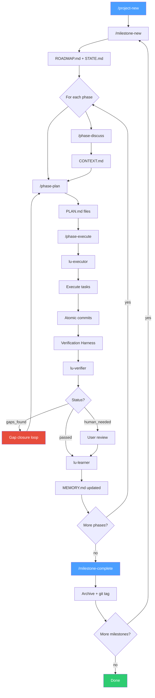

# Luca Workflow Overview

Full lifecycle of a Luca project from initialization through milestone completion.

## Key Artifacts

| Step               | Input              | Output                                |
| ------------------ | ------------------ | ------------------------------------- |
| project-new        | User description   | PROJECT.md, BRAIN.md, ROADMAP.md      |
| milestone-new      | Backlog todos      | ROADMAP.md, STATE.md, REQUIREMENTS.md |
| phase-discuss      | Phase goal         | CONTEXT.md                            |
| phase-plan         | Context + Research | PLAN.md files                         |
| phase-execute      | PLAN.md files      | Code + SUMMARY.md                     |
| verify             | Code + Plans       | VERIFICATION.md                       |
| learn              | WORKING.md         | MEMORY.md                             |
| milestone-complete | All phases         | Archive + git tag                     |
