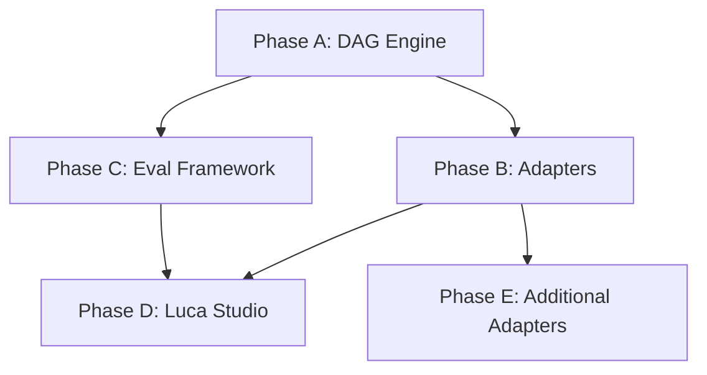

# Runtime Architecture Roadmap

**Date:** 2026-03-23
**Status:** Proposed
**Parent:** [Architectural Vision](./architectural-vision.md)

## Phased Implementation

### Phase A: DAG Workflow Engine + Typed Step Contracts

**Goal:** Replace the prose-based orchestrator with a typed DAG engine. The DAG definition becomes the source of truth; prose is a compilation output.

**Scope:**

- New domain: `src/workflow/` (T1 Core)
- `WorkflowStepSchema`, `WorkflowDAGSchema` with Zod validation
- `contracts.schemas.ts` — typed input/output schemas per step (classify, discuss, plan, execute, verify, learn, commit)
- `dag-builder.ts` — fluent API for constructing DAGs
- `dag-validator.ts` — static analysis (cycles, missing deps, schema compatibility)
- `dag-executor.ts` — execute steps through an adapter interface
- `dag-visualizer.ts` — generate Mermaid diagrams from DAG definitions
- `dag-serializer.ts` — serialize/deserialize DAG state for checkpoint/resume

**Does NOT include:**

- Replacing lu.skill.ts (that happens when the Claude adapter is ready)
- API adapter (Phase B)
- Luca Studio (Phase D)

**Key deliverables:**

- The phase pipeline (classify → discuss → plan → execute → verify → learn → commit) expressed as a typed DAG
- Build-time validation that catches step contract mismatches
- Mermaid diagram generation for documentation

**Estimated effort:** 2-3 weeks

---

### Phase B: Adapter Architecture (Claude + API)

**Goal:** Refactor the compiler into pluggable adapters. Add a headless API adapter for CI/CD and evaluation.

**Scope:**

- New domain: `src/adapters/` (T3 Build — same tier as compilers, uses dependency injection)
- `Adapter` interface defined in `src/workflow/__schemas/` (T1)
- Claude adapter — refactor existing compiler logic into adapter form (no behavioral changes)
- API adapter — headless execution via Claude Agent SDK (provides all tools natively, no custom tool bridge needed)
- Adapter registry — discover and select adapters based on environment
- Wire DAG executor to call `adapter.executeStep()`

**Does NOT include:**

- Cursor/Windsurf adapters (Phase E)
- Luca Studio (Phase D)

**Key deliverables:**

- `bun run build:all` produces same output via Claude adapter (backward compat)
- New `luca run --headless` command executes workflows via API adapter
- The lu.skill.ts prose is now generated from the DAG definition via Claude adapter

**Estimated effort:** 2-3 weeks

---

### Phase C: Agent Evaluation Framework -- COMPLETE

**Status:** Complete (v6.0.0, Phase 05)

**Goal:** Systematic agent quality measurement. Runs against the API adapter (headless), CI-friendly.

**Scope:**

- New domain: `src/eval/` (T1 Core)
- `EvalCaseSchema`, `EvalSuiteSchema`, `EvalResultSchema`
- `eval-runner.ts` — run eval suites against agents via API adapter
- `eval-reporter.ts` — generate quality reports (pass/fail, accuracy, latency)
- `eval-comparator.ts` — compare results across agent versions (regression detection)
- Seed eval cases for critical agents:
  - lu-router: complexity classification accuracy
  - lu-verifier: gap detection precision
  - convergence detector: stall identification accuracy

**Does NOT include:**

- Continuous eval in CI (future, depends on API adapter maturity)
- Cost optimization (future)

**Key deliverables:**

- `bun run eval:run` command runs agent evaluation suites
- Quality reports per agent with pass/fail and accuracy metrics
- Regression detection between agent versions
- Three seed eval suites: lu-router (25 cases), lu-verifier (25 cases), convergence (25 cases)

**Estimated effort:** 1-2 weeks

**Note:** Phase C was developed against a mock adapter in parallel with Phase B, as planned.

---

### Phase D: Luca Studio (Lightweight Dev Server)

**Goal:** Visual development tooling — workflow DAG visualization, agent browser, eval results, state machine inspector. Eliminates the build:all feedback loop problem.

**Scope:**

- New package: `packages/luca-studio/`
- Bun.serve() local dev server (no React dependency — lightweight HTML/CSS)
- Routes:
  - `/dag` — interactive workflow DAG visualization (from dag-visualizer.ts)
  - `/agents` — browse agent definitions, view compiled output, test invocation
  - `/evals` — run and view eval results
  - `/state` — inspect state machine transitions and current state
  - `/adapters` — view registered adapters and their capabilities
- File watcher — hot reload on `src/` changes without build:all
- No production deployment — local dev tool only

**Does NOT include:**

- Full Mastra Studio feature parity
- Agent playground with live LLM calls (future, requires API adapter)
- Team collaboration features

**Key deliverables:**

- `luca studio` command opens browser with DAG visualization
- Agent changes visible in seconds (no build:all required)
- Eval results viewable in browser

**Estimated effort:** 2-3 weeks

---

### Phase E: Additional Adapters

**Goal:** Multi-IDE support.

**Scope per adapter (~1 week each):**

- Cursor adapter — `.cursor/rules/*.mdc` format
- Windsurf adapter — Codeium format
- VS Code adapter — Copilot agent extension format (when API stabilizes)

**Depends on:** Phase B (adapter architecture)

---

## Dependency Graph

- **A** is the foundation — everything else depends on it
- **B** and **C** can overlap (C develops against mock adapter)
- **D** requires both B and C
- **E** requires B only

## Timeline (estimated)

| Phase                  | Effort      | Depends On         | Can Overlap With | Status       |
| ---------------------- | ----------- | ------------------ | ---------------- | ------------ |
| A: DAG Engine          | 2-3 weeks   | None               | —                |              |
| B: Adapters            | 2-3 weeks   | A                  | C                |              |
| C: Eval Framework      | 1-2 weeks   | A (interface only) | B                | **COMPLETE** |
| D: Luca Studio         | 2-3 weeks   | B, C               | —                |              |
| E: Additional Adapters | 1 week each | B                  | D                |              |

**Total estimated:** 8-12 weeks for Phases A-D. Phase E is ongoing.

## Success Criteria

After all phases complete:

- [ ] Workflow pipeline defined as typed DAG with Zod-validated step contracts
- [ ] Build-time validation catches step contract mismatches
- [ ] Mermaid diagrams auto-generated from DAG definitions
- [ ] Claude adapter produces identical output to current build:all (backward compat)
- [ ] API adapter enables headless workflow execution (CI/CD ready)
- [x] Agent evaluation suite with regression detection
- [ ] Luca Studio provides visual DAG, agent browser, and eval viewer
- [ ] At least one non-Claude adapter available
- [ ] Existing Luca users experience zero breaking changes
